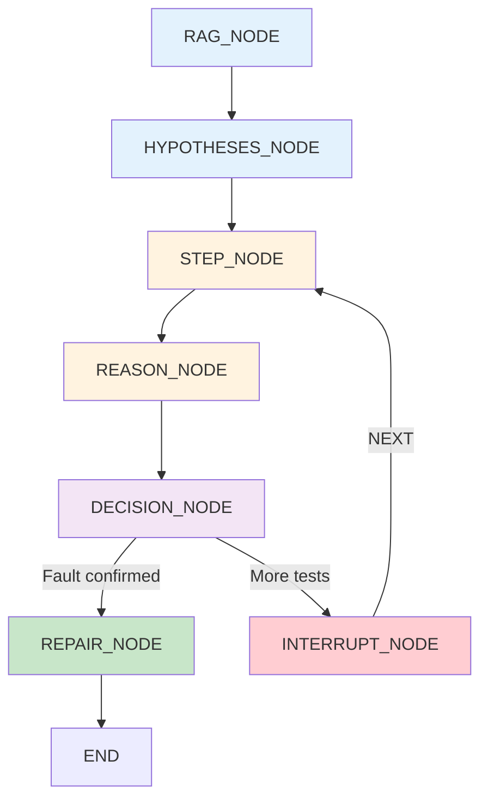

# Project Architecture

> How the system works - technical implementation details

---

## Tech Stack Breakdown

### Core Framework
| Component | Technology | Version |
|-----------|------------|---------|
| Agent Framework | LangGraph | ≥0.0.20 |
| LLM Framework | LangChain | ≥0.1.0 |
| Language | Python | ≥3.10 |
| Type Safety | Pydantic | ≥2.0.0 |

### Data & Storage
| Component | Technology | Purpose |
|-----------|------------|---------|
| Vector Database | ChromaDB (embedded) | RAG knowledge base - no server needed |
| Configuration | YAML | Equipment-specific thresholds, faults |
| Knowledge Docs | Markdown | Equipment diagnostics documentation |

### AI/ML
| Component | Technology | Purpose |
|-----------|------------|---------|
| Primary LLM | Groq (Llama 3.3 70B) | Diagnostic reasoning |
| Fallback LLM | Ollama (local) | Offline capability |
| Embeddings | sentence-transformers | Local embedding (all-MiniLM-L6-v2) |
| Observability | LangSmith | Full run tracing |

### Hardware Integration
| Component | Technology | Purpose |
|-----------|------------|---------|
| Serial Communication | pyserial | Mastech MS8250D multimeter |
| Protocol | UART @ 2400 baud | CP210x USB-to-Serial adapter |

---

## Folder Structure (Current)

```
ai-agent/
├── .coding-agent/              # AI project memory system
│   ├── AGENTS.md               # Entry point (READ THIS FIRST)
│   ├── STATUS.md               # Current state
│   ├── SPEC.md                 # Product spec
│   └── ARCHITECTURE.md         # Technical details (YOU ARE HERE)
│
├── src/
│   ├── domain/                 # Business logic (no framework dependencies)
│   │   └── models.py           # Domain models & services
│   │
│   ├── infrastructure/         # External integrations
│   │   ├── config.py           # Centralized configuration
│   │   ├── chromadb_client.py  # ChromaDB (embedded mode)
│   │   ├── llm_manager.py      # LLM provider management
│   │   ├── usb_multimeter.py   # Serial communication (MS8250D)
│   │   ├── equipment_config.py # YAML loader
│   │   ├── rag_repository.py   # RAG operations
│   │   └── multimeter_stabilizer.py # Stabilization engine
│   │
│   ├── interfaces/             # User-facing interfaces
│   │   ├── cli.py             # Command-line interface
│   │   └── mode_router.py     # Mock/USB mode selection
│   │
│   └── studio/                 # LangGraph Studio integration
│       ├── tools.py            # LangGraph tools (RAG + measurement)
│       ├── conversational_agent.py # Main diagnostic agent
│       └── background_usb_reader.py # Async USB reading
│
├── data/
│   ├── equipment/              # Equipment configurations (YAML)
│   │   └── cctv-psu-24w-v1.yaml
│   ├── knowledge/              # RAG documentation
│   │   └── cctv-psu-24w-v1-diagnostics.md
│   └── chromadb/               # Vector database (auto-generated)
│
├── test_mm.py                  # Multimeter test script
├── start.bat                   # Windows startup script
└── langgraph.json             # LangGraph Studio config
```

---

## System Architecture Diagram

```mermaid
graph TB
    subgraph "Input"
        USB[USB Mode<br/>Mastech MS8250D<br/>via CP210x]
    end

    subgraph "CLI Interface"
        CLI[src/interfaces/cli.py]
    end

    subgraph "LangGraph Workflow<br/>src/studio/conversational_agent.py"
        RAG[RAG_NODE<br/>Retrieve diagnostic knowledge]
        HYP[HYPOTHESES_NODE<br/>Generate fault hypotheses]
        STEP[STEP_NODE<br/>Atomic diagnostic step]
        REASON[REASON_NODE<br/>Evaluate measurement]
        DECISION[DECISION_NODE<br/>Determine next action]
        REPAIR[REPAIR_NODE<br/>Output repair steps]
    end

    subgraph "Domain Layer"
        MODELS[Models & Services<br/>src/domain/models.py]
    end

    subgraph "Infrastructure"
        CHROMA[ChromaDB<br/>(embedded)]
        LLM[LLM Client (Groq)]
        EQUIP[Equipment Config]
        MULTI[USB Multimeter<br/>usb_multimeter.py]
        STABILIZER[MultimeterStabilizer]
    end

    USB --> CLI
    CLI --> RAG

    RAG --> HYP
    HYP --> STEP
    STEP --> REASON
    REASON --> DECISION
    DECISION -->|Fault confirmed| REPAIR
    DECISION -->|More tests| INTERRUPT
    
    RAG -.-> CHROMA
    STEP -.-> MULTI
    STEP -.-> STABILIZER
    STEP -.-> EQUIP
    MODELS -.-> EQUIP
```

---

## Key Components

### LangGraph Workflow Nodes

The diagnostic agent uses a 7-node LangGraph workflow:

| Node | File | Responsibility |
|------|------|----------------|
| RAG_NODE | conversational_agent.py | Query ChromaDB for diagnostic guidance |
| HYPOTHESES_NODE | conversational_agent.py | Generate hypothesis list from RAG + config |
| STEP_NODE | conversational_agent.py | Perform atomic diagnostic step |
| REASON_NODE | conversational_agent.py | Evaluate measurement against hypothesis |
| DECISION_NODE | conversational_agent.py | Route based on hypothesis state |
| REPAIR_NODE | conversational_agent.py | Output repair guidance |
| INTERRUPT_NODE | conversational_agent.py | Pause for user "Next" |

### Workflow Flow



---

## USB Multimeter Integration

### Supported Modes

The MS8250D multimeter parser supports all measurement modes:

| Mode | Unit | Type Code |
|------|------|-----------|
| DC Voltage | V | `DC_VOLTAGE` |
| AC Voltage | V | `AC_VOLTAGE` |
| DC Current | A | `DC_CURRENT` |
| AC Current | A | `AC_CURRENT` |
| Resistance | Ω | `RESISTANCE` |
| Continuity | Ω | `CONTINUITY` |
| Diode | V | `DIODE` |
| Frequency | Hz | `FREQUENCY` |
| Capacitance | F | `CAPACITANCE` |

### Parser Details

File: [`src/infrastructure/usb_multimeter.py`](src/infrastructure/usb_multimeter.py)

- **18-byte Frame Parser**: For newer protocol format
- **10-byte Frame Parser**: For older UM24C-compatible format
- **Auto-detection**: Automatically detects COM port via USB VID

---

## Configuration System

### Environment Variables

```python
# src/infrastructure/config.py
GROQ_API_KEYS=key1,key2      # Multiple keys (auto-rotates)
LLM_MODELS=model1,model2      # Multiple models (fallback chain)
LANCHAIN_API_KEY=your_key
LANGSMITH_TRACING=true
```

### Equipment YAML Schema

```yaml
# data/equipment/cctv-psu-24w-v1.yaml
equipment_model: CCTV-PSU-24W-V1

signals:
  output_rail:
    signal_id: output_rail
    test_point: TP1
    parameter: voltage
    unit: V

thresholds:
  output_rail:
    normal:
      min: 22.0
      max: 26.0

faults:
  overvoltage:
    priority: 1
    signatures:
      - test_point: output_rail
        state: over_voltage
    hypotheses:
      - component: zener_diode
        cause: Zener failure
    recovery:
      - action: replace
        instruction: Replace Zener diode
```

---

## Design Principles

### 1. Step-by-Step Control
- Each diagnostic step is atomic: show → measure → evaluate → decide
- Interrupt between steps using `langgraph.types.interrupt()`
- User must confirm "Next" before measurement proceeds

### 2. RAG-Grounded Evidence
- ALL diagnostic guidance comes from ChromaDB
- No free-form LLM responses without RAG context
- Prevents hallucinations in fault diagnosis

### 3. Stabilized Measurements
- Multimeter readings stabilized before interpretation
- Rolling window + cluster detection algorithm
- Confidence levels: HIGH / MEDIUM / LOW

### 4. Embedded Dependencies
- ChromaDB runs in embedded mode - no Docker or server required

---

## Running the System

### Test Multimeter
```bash
python test_mm.py
```

### LangGraph Studio (requires venv or PATH fix)
```bash
start.bat
# OR
venv\Scripts\langgraph dev --port 2024
```

---

## Memory Stewardship

This file is part of the `.coding-agent/` memory system. Any architectural changes must be reflected here.

**Last Updated**: 2026-03-23
**Key Changes**: 
- Updated folder structure (removed mock_signals, tests, legacy files)
- Added multimeter mode detection details
- Reflected current working state
