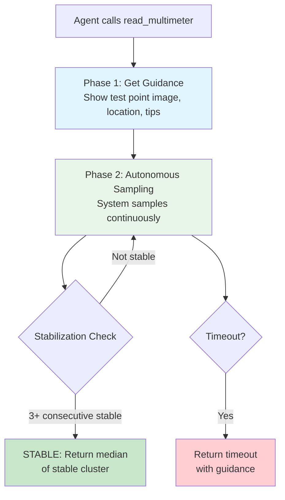

# Project Architecture

> How the system works - technical implementation details

---

## Tech Stack Breakdown

### Core Framework
| Component | Technology | Version |
|-----------|------------|---------|
| Agent Framework | LangGraph | ≥0.0.20 |
| LLM Framework | LangChain | ≥0.1.0 |
| Language | Python | ≥3.10 |
| Type Safety | Pydantic | ≥2.0.0 |

### Data & Storage
| Component | Technology | Purpose |
|-----------|------------|---------|
| Vector Database | ChromaDB (embedded) | RAG knowledge base - no server needed |
| Configuration | YAML | Equipment-specific thresholds, faults |
| Knowledge Docs | Markdown | Equipment diagnostics documentation |

### AI/ML
| Component | Technology | Purpose |
|-----------|------------|---------|
| Primary LLM | Groq (Llama 3.3 70B) | Diagnostic reasoning |
| Fallback LLM | Ollama (local) | Offline capability |
| Embeddings | sentence-transformers | Local embedding (all-MiniLM-L6-v2) |
| Observability | LangSmith | Full run tracing |

### Hardware Integration
| Component | Technology | Purpose |
|-----------|------------|---------|
| Serial Communication | pyserial | Mastech MS8250D multimeter |
| Protocol | UART @ 2400 baud | CP210x USB-to-Serial adapter |

---

## Folder Structure

```
ai-agent/
├── .coding-agent/              # AI project memory system
│   ├── AGENTS.md               # Entry point (READ THIS FIRST)
│   ├── STATUS.md               # Current state
│   ├── SPEC.md                 # Product spec
│   ├── ARCHITECTURE.md         # Technical details (YOU ARE HERE)
│   └── sessions/               # Session history
│
├── src/
│   ├── application/            # LangGraph workflow definition
│   │   ├── agent.py            # Main diagnostic workflow (6 nodes)
│   │   └── conversational_agent.py  # Conversational variant
│   │
│   ├── domain/                 # Business logic (no framework dependencies)
│   │   └── models.py           # Domain models & services
│   │                           
│   ├── infrastructure/         # External integrations
│   │   ├── config.py           # Centralized configuration
│   │   ├── chromadb_client.py  # ChromaDB (embedded mode)
│   │   ├── llm_client.py      # Groq/Ollama LLM wrapper
│   │   ├── usb_multimeter.py   # Serial communication
│   │   ├── equipment_config.py # YAML loader
│   │   └── rag_repository.py  # RAG operations
│   │
│   ├── interfaces/             # User-facing interfaces
│   │   ├── cli.py             # Command-line interface
│   │   └── mode_router.py     # Mock/USB mode selection
│   │
│   └── studio/                 # LangGraph Studio integration
│       ├── langgraph_studio.py # Studio entry point
│       ├── tools.py            # LangGraph tools
│       ├── conversational_agent.py # Studio agent
│       └── background_usb_reader.py # Async USB reading
│
├── data/
│   ├── equipment/              # Equipment configurations (YAML)
│   │   └── cctv-psu-24w-v1.yaml
│   ├── knowledge/              # RAG documentation
│   │   └── cctv-psu-24w-v1-diagnostics.md
│   └── mock_signals/           # Test scenarios (JSON)
│       └── scenarios.json
│
├── docs/                       # Project documentation
├── tests/                      # Unit tests
├── pyproject.toml              # Python dependencies
└── langgraph.json             # LangGraph Studio config
```

---

## System Architecture Diagram

```mermaid
graph TB
    subgraph "Input Sources"
        MOCK[Mock Mode<br/>JSON Scenarios]
        USB[USB Mode<br/>Mastech MS8250D<br/>via CP210x]
    end

    subgraph "CLI Interface"
        CLI[src/interfaces/cli.py]
        ROUTE[Mode Router]
    end

    subgraph "LangGraph Workflow<br/>src/application/agent.py"
        VALID[validate_input]
        INTERPRET[interpret_signals]
        RETRIEVE[retrieve_evidence]
        ANALYZE[analyze_fault]
        RECOMMEND[generate_recommendations]
        RESPOND[generate_response]
    end

    subgraph "Domain Layer<br/>src/domain/"
        MODELS[Models & Services]
        INTERPRETER[Signal Interpreter]
        MATCHER[Fault Matcher]
        GENERATOR[Hypothesis Generator]
    end

    subgraph "Infrastructure<br/>src/infrastructure/"
        CONFIG[Configuration]
        CHROMA[ChromaDB<br/>(embedded)]
        LLM[LLM Client (Groq)]
        EQUIP[Equipment Config]
    end

    MOCK --> ROUTE
    USB --> ROUTE
    ROUTE --> CLI
    CLI --> VALID
    VALID --> INTERPRET
    INTERPRET --> RETRIEVE
    RETRIEVE --> ANALYZE
    ANALYZE --> RECOMMEND
    RECOMMEND --> RESPOND

    INTERPRET -.-> INTERPRETER
    ANALYZE -.-> MATCHER
    ANALYZE -.-> LLM
    RETRIEVE -.-> CHROMA
    RECOMMEND -.-> GENERATOR
    INTERPRETER -.-> EQUIP
    MATCHER -.-> EQUIP
    GENERATOR -.-> EQUIP
```

---

## Data Flow

### Phase 1: Input Collection

```
┌─────────────────┐     ┌──────────────────┐     ┌─────────────────────┐
│ Mock (JSON)     │     │ USB Multimeter   │     │ CLI Parameters      │
│                 │     │ (Serial Read)    │     │                     │
│ raw_measurements│     │ raw_measurements │     │ equipment_model     │
│ [{test_point,   │     │ [{test_point,    │     │ trigger_content     │
│   value, unit}] │     │   value, unit}]  │     │                     │
└────────┬────────┘     └────────┬─────────┘     └──────────┬──────────┘
         │                       │                          │
         └───────────────────────┼──────────────────────────┘
                                 ▼
                    ┌─────────────────────┐
                    │   AgentState        │
                    │   (LangGraph State) │
                    │                     │
                    │ trigger_type        │
                    │ trigger_content     │
                    │ equipment_model     │
                    │ raw_measurements   │
                    └─────────────────────┘
```

### Phase 2: Signal Interpretation

```python
# src/domain/models.py - SignalInterpreter
class SignalInterpreter:
    def interpret(measurements, equipment_config):
        # Load thresholds from YAML
        thresholds = equipment_config.thresholds
        
        # Map each measurement to semantic state
        for measurement in measurements:
            threshold = thresholds[measurement.test_point]
            
            if measurement.value > threshold.max:
                state = SignalState.OVER_VOLTAGE
            elif measurement.value < threshold.min:
                state = SignalState.UNDER_VOLTAGE
            else:
                state = SignalState.NORMAL
        
        return signal_states, overall_status, anomaly_count
```

### Phase 3: Evidence Retrieval (ChromaDB Embedded)

```python
# src/infrastructure/chromadb_client.py
# Uses embedded ChromaDB - no server needed

from chromadb import Client as ChromaClient

# Initialize (no host/port needed - runs embedded)
chroma_client = ChromaClient()

# Query (same API as server mode)
results = collection.query(
    query_texts=[query],
    n_results=3
)
```

### Phase 4: Fault Analysis

```python
# src/domain/models.py - FaultMatcher + LLM
class FaultMatcher:
    def match(signal_states, equipment_config):
        # Rule-based matching first
        for fault_signature in equipment_config.faults:
            if self._matches(signal_states, fault_signature):
                return fault_hypothesis
        
        # Fall back to LLM for complex cases
        return llm_client.analyze(signal_states, evidence)
```

### Phase 5: Recommendation Generation

```python
# src/domain/models.py - RecommendationGenerator
class RecommendationGenerator:
    def generate(fault_id, equipment_config):
        # Load recovery steps from YAML
        recovery = equipment_config.recovery_steps[fault_id]
        
        # Build prioritized recommendations
        recommendations = [
            Recommendation(
                priority=step.priority,
                action=step.action,
                instruction=step.instruction,
                safety_warning=step.warning
            )
            for step in recovery.steps
        ]
        
        return recommendations
```

---

## Key Components

### LangGraph Workflow Nodes

| Node | File | Responsibility |
|------|------|----------------|
| [`validate_input`](src/application/agent.py:45) | agent.py | Validates equipment_model and measurements exist |
| [`interpret_signals`](src/application/agent.py:78) | agent.py | Converts raw measurements to semantic states |
| [`retrieve_evidence`](src/application/agent.py:112) | agent.py | Queries ChromaDB for supporting docs |
| [`analyze_fault`](src/application/agent.py:145) | agent.py | Matches signals to faults + LLM reasoning |
| [`generate_recommendations`](src/application/agent.py:178) | agent.py | Builds recovery steps from YAML |
| [`generate_response`](src/application/agent.py:211) | agent.py | Constructs final structured response |

### Autonomous Measurement Flow (NEW!)

The conversational agent now uses an autonomous two-phase measurement flow:



**Key Components:**

| Component | File | Purpose |
|-----------|------|---------|
| [`RobustStabilizer`](src/studio/background_usb_reader.py:45) | background_usb_reader.py | MAD-based outlier rejection |
| [`MeasurementPhase`](src/studio/background_usb_reader.py:27) | background_usb_reader.py | State machine enum |
| [`read_multimeter`](src/studio/tools.py:343) | tools.py | Integrated guidance + sampling tool |

**Stabilization Algorithm:**
1. Maintain rolling window of 30 samples
2. Apply MAD (Median Absolute Deviation) for outlier detection
3. Find clusters of 5+ consecutive stable readings
4. Require 3 consecutive stable samples (dwell time)
5. Return trimmed mean of newest stable cluster

### Infrastructure Components

| Component | File | Purpose |
|-----------|------|---------|
| [`AppConfig`](src/infrastructure/config.py:18) | config.py | Centralized configuration dataclass |
| [`ChromaDBClient`](src/infrastructure/chromadb_client.py:15) | chromadb_client.py | ChromaDB embedded client |
| [`LLMClient`](src/infrastructure/llm_client.py:20) | llm_client.py | Groq/Ollama LLM abstraction |
| [`USBMultimeter`](src/infrastructure/usb_multimeter.py:40) | usb_multimeter.py | Serial communication with MS8250D |
| [`EquipmentConfigLoader`](src/infrastructure/equipment_config.py:20) | equipment_config.py | YAML parsing for equipment |

---

## Configuration System

### Environment Variables

```python
# src/infrastructure/config.py
@dataclass
class AppConfig:
    mode: str = "mock"          # "mock" or "usb"
    
    llm: LLMConfig              # Provider: "groq" or "ollama"
                                # Model: "llama-3.3-70b-versatile"
                                # Temperature: 0.0-1.0
    
    embedding: EmbeddingConfig  # Provider: "sentence-transformers"
                                # Model: "all-MiniLM-L6-v2"
    
    usb: USBConfig              # Port: "COM3" (auto-detect)
                                # Baud: 2400
    
    mock: MockConfig            # Default scenario name
```

### Equipment YAML Schema

```yaml
# data/equipment/cctv-psu-24w-v1.yaml
equipment_model: CCTV-PSU-24W-V1
manufacturer: Generic CCTV
power_output: 24W

test_points:
  output_rail:
    nominal_voltage: 24.0
    tolerance: 0.10
    unit: V
  # ... more test points

faults:
  overvoltage_output:
    signature:
      - test_point: output_rail
        state: over_voltage
    hypothesis: "Zener diode failure"
    confidence_weight: 0.9

recovery:
  overvoltage_output:
    - priority: 1
      action: "Replace Zener diode"
      instruction: |
        1. Disconnect power
        2. Locate Zener on PCB
        ...
```

---

## Design Principles

### 1. Data-Driven Everything
Equipment-specific logic lives in YAML, not code:
- Thresholds → YAML
- Fault signatures → YAML
- Recovery steps → YAML
- Equipment docs → Markdown

### 2. Immutable State
LangGraph passes `AgentState` dataclass between nodes:
```python
@dataclass
class AgentState:
    trigger_type: str
    trigger_content: str
    equipment_model: str
    raw_measurements: List[Measurement]
    signal_states: List[SignalState] = None
    evidence: List[str] = None
    hypothesis: Dict = None
    recommendations: List[Dict] = None
    error: str = None
```

### 3. Explicit Contracts
Each node declares inputs/outputs:
```python
def validate_input(state: AgentState) -> AgentState:
    """Validates required fields in input state.
    
    Input: state.trigger_type, state.equipment_model, state.raw_measurements
    Output: state.error (if validation fails)
    """
```

### 4. Hybrid Intelligence
- **Deterministic**: Rule-based matching for known fault patterns
- **Probabilistic**: LLM reasoning for ambiguous cases
- **Fallback chain**: Rules first → LLM for edge cases

### 5. Embedded Dependencies
ChromaDB runs in embedded mode - no Docker or server required:
```python
# Simple as:
from chromadb import Client
client = Client()  # Works out of the box!
```

---

## Running the System

### Mock Mode (No Hardware)
```bash
pip install -r requirements.txt
python -m src.interfaces.cli --mock
# Uses scenarios from data/mock_signals/
```

### USB Mode (Real Hardware - Mastech MS8250D)
```bash
pip install -r requirements.txt
python -m src.interfaces.cli --usb CCTV-PSU-24W-V1
# Connects to Mastech MS8250D via USB (CP210x adapter)
```

### LangGraph Studio
```bash
langgraph dev --port 2024
# Opens web UI for debugging
```
