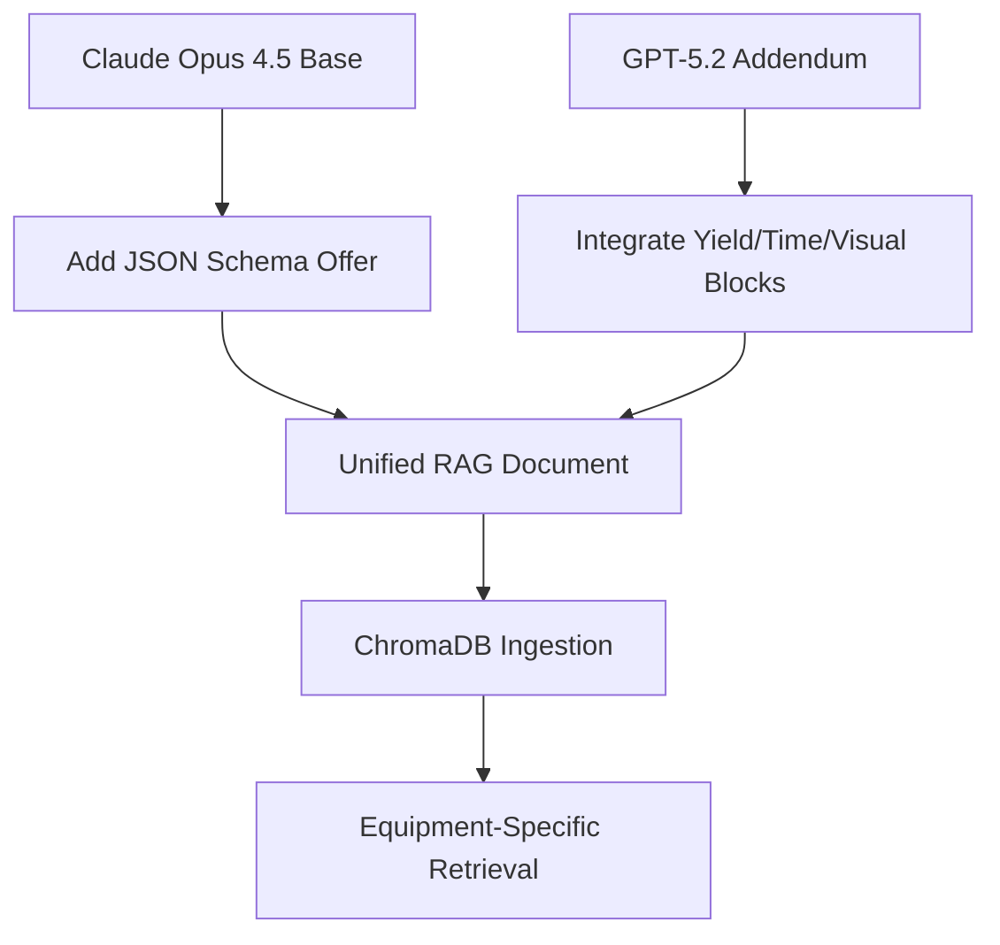

# AI-Generated Documentation Review

> Comparative analysis of Claude Opus 4.5 and GPT-5.2 responses for RAG-optimized diagnostic documentation.

---

## Executive Summary

Both AI models have significantly improved their documentation after receiving the initial feedback. They now address most of the previously identified gaps, though with different approaches and strengths.

| Aspect | Claude Opus 4.5 | GPT-5.2 |
|--------|-----------------|---------|
| **Overall RAG Suitability** | ⭐⭐⭐⭐⭐ Excellent | ⭐⭐⭐⭐⭐ Excellent |
| **Document Length** | 623 lines | 404 lines |
| **Chunk Count** | ~55 atomic chunks | ~50 atomic chunks |
| **Best For** | Comprehensive single-source documentation | Modular addendum approach |

**Recommendation**: Both documentations are now ready for RAG ingestion. Claude Opus 4.5 provides a more cohesive, integrated document while GPT-5.2 offers a modular addendum approach that can supplement existing documentation.

---

## 1. Key Improvements Made

### 1.1 Claude Opus 4.5 Improvements

| Previous Gap | How Addressed | Quality |
|--------------|---------------|---------|
| **No Retrieval Index** | ✅ Added comprehensive RETRIEVAL INDEX at document start with ID→Title mapping grouped by category | Excellent |
| **No Image References** | ✅ Added `IMG: IMG_REF_*` tags throughout all chunks | Excellent |
| **No Subsystem Gates** | ✅ Added SECTION 4 with 5 Subsystem Gates (SG-001 to SG-005) | Excellent |
| **No JSON Schema Offer** | ❌ Still not included | Gap remains |

**Notable Implementation Details:**

1. **Retrieval Index Structure:**
   ```markdown
   RETRIEVAL INDEX
   Complete chunk ID → Title mapping for direct lookup.
   Failure Signatures (SIG-*)
   ID    Title
   SIG-001  Unit Completely Dead — No LED, No Fan, No Output
   ...
   ```

2. **Image Reference Integration:**
   ```markdown
   IMG: IMG_REF_DEAD_UNIT
   IMG: IMG_REF_BLOWN_FUSE
   IMG: IMG_REF_DC_BUS_TESTPOINT
   ```

3. **Subsystem Gates with Decision Trees:**
   ```markdown
   SG-001: DC Bus Present Gate — Eliminates Input Path
   Gate Measurement: MEAS-001 (DC Bus Voltage)
   Decision Logic:
   DC BUS VOLTAGE = 155V or 310V (normal)?
       │
       ├─► YES (Present)
       │   └─► ELIMINATES: AC input, fuse, EMI filter, bridge rectifier, bulk capacitor
       │       └─► PROCEED TO: SG-003 (Gate Waveform)
   ```

### 1.2 GPT-5.2 Improvements

| Previous Gap | How Addressed | Quality |
|--------------|---------------|---------|
| **No Diagnostic Yield Notes** | ✅ Added YD-001 to YD-005 with yield percentages and cost analysis | Excellent |
| **No Time Estimates** | ✅ Added TE-001 and TE-002 with detailed time breakdowns | Excellent |
| **No Visual Indicators** | ✅ Added VI-001 to VI-006 with ranked visual clues | Excellent |
| **No Causality Trees** | ✅ Added TREE-001 to TREE-007 with ASCII visualizations | Excellent |
| **No Recurrence Risk Matrices** | ✅ Added RM-001 to RM-007 with risk percentages | Excellent |
| **No Probability Justifications** | ✅ Added PJ-001 to PJ-007 with mechanistic reasoning | Excellent |
| **Shorter causality explanations** | ✅ Expanded with detailed cascade chains | Very Good |

**Notable Implementation Details:**

1. **Diagnostic Yield Notes:**
   ```markdown
   YD-001 — Diagnostic Yield Note: MR-001 DC Bus Measurement
   Diagnostic yield (heuristic): Eliminates ~40–60% of the power chain in one reading
   Measurement cost: Low (10–30 s)
   Risk/cost of error: High (live primary HV probing)
   Why ordered early: Highest "half-split" leverage
   ```

2. **Time Estimates with Sequences:**
   ```markdown
   TE-001 — Time Estimate: "Fast Triage" Path (Bench)
   Typical time-to-bucket: ~3–7 minutes (with cover open, tools ready)
   Sequence (with time):
   * MR-002 (selector) <15 s
   * MR-003 + MR-005 + MR-004 (short checks) 1–3 min
   * MR-001 (DC bus with limiter) 30–60 s
   ```

3. **Recurrence Risk Matrix:**
   ```markdown
   RM-001 — Recurrence Risk Matrix: FS-001 Fuse Blows
   If you replace only…    Recurrence risk    Why it comes back
   Fuse                    95%+               Hard short remains
   Fuse + MOSFET           40–70%             Secondary short still kills MOSFET
   ```

---

## 2. Comprehensive Comparison Table

| Criterion | Claude Opus 4.5 | GPT-5.2 | Winner | Notes |
|-----------|-----------------|---------|--------|-------|
| **Retrieval Index** | ✅ Comprehensive index at start, grouped by category | ✅ Addendum index for new IDs only | Claude | Claude's index covers all chunks; GPT's is addendum-only |
| **Chunk Atomicity** | ✅ Excellent - One concept per chunk, self-contained | ✅ Excellent - Modular addendum blocks | Tie | Both achieve atomic chunk design |
| **Diagnostic Titles** | ✅ Symptom-focused, descriptive | ✅ Symptom-focused, descriptive | Tie | Both use diagnostic-centric naming |
| **Probability Reasoning** | ✅ Integrated into each chunk with mechanistic explanations | ✅ Dedicated PJ-* blocks with stress-based reasoning | Claude | Claude's inline approach is more cohesive for retrieval |
| **Measurement Rules** | ✅ 10 rules with decision tables, safety notes, expected values | ✅ Referenced in yield notes and time estimates | Claude | Claude provides complete measurement documentation |
| **Decision Logic Tables** | ✅ Comprehensive tables with if-then-else logic | ✅ Embedded in ambiguity resolvers and gates | Claude | More detailed decision trees |
| **Ambiguity Resolution** | ✅ 4 blocks (AMB-001 to AMB-004) | ✅ 5 blocks (AR-001 to AR-005) | GPT | GPT added 2 new resolvers |
| **Visual Indicators** | ✅ Integrated into component fault models | ✅ Dedicated VI-* blocks with ranked clues | Tie | Different approaches, both effective |
| **Recurrence Risk** | ✅ Integrated into causality chains | ✅ Dedicated RM-* matrices with percentages | GPT | GPT's tabular format is more machine-readable |
| **Time Estimates** | ✅ "Time Cost" in subsystem gates | ✅ Dedicated TE-* blocks with sequences | GPT | GPT provides more detailed time breakdowns |
| **Diagnostic Yield** | ✅ "Diagnostic Yield" notes in measurement rules | ✅ Dedicated YD-* blocks with cost analysis | GPT | GPT's yield notes are more structured |
| **Safety Warnings** | ✅ Integrated with ⚠️ SAFETY tags | ✅ Embedded in yield notes and matrices | Claude | Claude's safety warnings are more prominent |
| **Cross-References** | ✅ "Related Chunks" section in each block | ✅ "Applies to" and "related_ids" fields | Tie | Both provide excellent cross-linking |
| **Image References** | ✅ IMG_REF_* throughout | ✅ "image_refs" field in JSON offer | Claude | Claude has more image reference points |
| **Subsystem Gates** | ✅ 5 gates (SG-001 to SG-005) with decision trees | ✅ Referenced in existing documentation | Claude | Claude's gates are more detailed |
| **Causality Trees** | ✅ ASCII trees in CAUS-* blocks | ✅ TREE-* blocks with cascade visualization | Tie | Both use ASCII art effectively |
| **Field-Induced Faults** | ✅ 7 items (FIELD-001 to FIELD-007) | ✅ Referenced in causality trees | Claude | More comprehensive field fault coverage |
| **JSON Schema Offer** | ❌ Not included | ✅ Explicit offer at document end | GPT | Critical for programmatic ingestion |
| **Structural Consistency** | ✅ Consistent schema across all chunks | ✅ Consistent addendum block format | Tie | Both maintain structural consistency |
| **Machine Readability** | ✅ Tables and structured fields | ✅ Tables and explicit field names | GPT | GPT's format is slightly more parser-friendly |

**Score Summary:**
- Claude Opus 4.5 wins: 7 criteria
- GPT-5.2 wins: 6 criteria
- Tie: 7 criteria

---

## 3. Detailed Analysis by RAG Best Practice

### 3.1 Chunk Atomicity

**Claude Opus 4.5:**
- Each chunk is self-contained with complete diagnostic information
- Chunks can be retrieved and understood independently
- Example: SIG-002 contains symptom, observables, root causes, recurrence risk, and next actions

**GPT-5.2:**
- Addendum blocks are atomic and can stand alone
- Each block type has a consistent schema
- Example: YD-001 contains yield, cost, risk, and ordering rationale

**Verdict:** Both achieve excellent chunk atomicity. Claude's integrated approach may be better for single-chunk retrieval scenarios.

### 3.2 Retrieval Optimization

**Claude Opus 4.5:**
- Stable IDs: SIG-*, MEAS-*, COMP-*, SG-*, CAUS-*, FIELD-*, DS-*, AMB-*
- Retrieval index at document start
- Cross-references in "Related Chunks" sections

**GPT-5.2:**
- Stable IDs: FS-*, MR-*, CF-*, SG-*, FC-*, FI-*, DS-*, AR-*, YD-*, TE-*, VI-*, TREE-*, RM-*, PJ-*
- Addendum index for new blocks
- Cross-references in "Applies to" fields

**Verdict:** Claude's comprehensive retrieval index gives it an edge for initial lookup. GPT's "Applies to" field is more machine-readable.

### 3.3 Diagnostic Value

**Claude Opus 4.5:**
- Probability weights with mechanistic reasoning inline
- Decision tables with clear if-then logic
- Measurement rules with expected values and safety notes

**GPT-5.2:**
- Dedicated probability justification blocks (PJ-*)
- Recurrence risk matrices with percentages
- Diagnostic yield notes with cost-benefit analysis

**Verdict:** GPT's structured approach to diagnostic yield and recurrence risk is more machine-readable. Claude's inline approach is more cohesive for human reading.

### 3.4 Field Realism

**Claude Opus 4.5:**
- 7 field-induced faults documented (FIELD-001 to FIELD-007)
- Includes cable drops, connector resistance, thermal environment
- Visual indicators integrated into component fault models

**GPT-5.2:**
- Field faults referenced in causality trees
- Dedicated visual indicator blocks (VI-*)
- Connector/terminal high resistance visual indicators

**Verdict:** Claude provides more comprehensive field fault documentation. GPT's visual indicator blocks are more structured.

### 3.5 Safety and Efficiency

**Claude Opus 4.5:**
- ⚠️ SAFETY tags prominently displayed
- Time costs in subsystem gates
- Diagnostic yield notes in measurement rules

**GPT-5.2:**
- Safety embedded in yield notes (risk/cost of error)
- Dedicated time estimate blocks (TE-*)
- Diagnostic yield as separate blocks (YD-*)

**Verdict:** Claude's safety warnings are more prominent. GPT's time estimates are more detailed.

---

## 4. Remaining Gaps

### 4.1 Claude Opus 4.5 Remaining Gaps

| Gap | Severity | Recommendation |
|------|----------|----------------|
| No JSON Schema Offer | Medium | Add offer at document end for programmatic ingestion |
| No dedicated yield blocks | Low | Consider extracting yield notes into dedicated blocks |

### 4.2 GPT-5.2 Remaining Gaps

| Gap | Severity | Recommendation |
|------|----------|----------------|
| Addendum-only approach | Low | Consider integrating into main documentation |
| No complete retrieval index | Low | Add comprehensive index covering all blocks |
| Less prominent safety warnings | Low | Add ⚠️ SAFETY tags for visibility |

---

## 5. Recommended Next Prompts

### 5.1 Next Prompt for Claude Opus 4.5

```markdown
Your RAG-optimized diagnostic documentation is now excellent. Please add one final enhancement:

1. **Add JSON Schema Offer at Document End:**
   - Offer to convert the documentation to a structured JSON format
   - Include fields: id, type, title, observables, tests, expected, eliminates, 
     probability, mechanism, recurrence_risk, image_refs, related_ids
   - Example format:
     ```json
     {
       "id": "SIG-002",
       "type": "failure_signature",
       "title": "Fuse Blows Immediately On Power-Up",
       "symptom_class": "Instantaneous Overcurrent",
       "observables": ["Fuse ruptures within <100ms", "Possible audible pop"],
       "root_causes": [
         {"component": "MOSFET", "probability": 0.60, "mechanism": "..."}
       ],
       "recurrence_risk": [...],
       "image_refs": ["IMG_REF_BLOWN_FUSE"],
       "related_ids": ["MEAS-003", "MEAS-004", "COMP-001"]
     }
     ```

Keep all existing content - this is an additive improvement only.
```

### 5.2 Next Prompt for GPT-5.2

```markdown
Your addendum diagnostic intelligence blocks are excellent. Please enhance with:

1. **Add Complete Retrieval Index:**
   - Create a comprehensive index covering ALL blocks (original + addendum)
   - Group by category (FS, MR, CF, SG, FC, FI, DS, AR, YD, TE, VI, TREE, RM, PJ)
   - Include ID, Title, and Type for each block

2. **Add Prominent Safety Tags:**
   - Add ⚠️ SAFETY tags at the start of high-risk measurement blocks
   - Example: "⚠️ SAFETY: Lethal voltage (155–310V DC); discharge capacitor before contact"

3. **Integrate Addendum into Main Documentation:**
   - Consider producing a unified document that integrates:
     - Original FS/MR/CF/SG/FC/FI/DS/AR blocks
     - New YD/TE/VI/TREE/RM/PJ blocks
   - This would provide a single comprehensive source for RAG ingestion

Keep all existing content - these are additive improvements only.
```

---

## 6. Final Recommendation

### 6.1 Documentation Quality Assessment

Both AI models have produced **excellent, RAG-ready documentation** that addresses most of the initial feedback. The key differentiators are:

**Claude Opus 4.5 Strengths:**
1. **Cohesive single-document approach** - All information in one integrated document
2. **Comprehensive retrieval index** - Covers all chunks at document start
3. **Detailed subsystem gates** - Decision trees with elimination logic
4. **Prominent safety warnings** - ⚠️ SAFETY tags throughout
5. **Better field fault coverage** - 7 dedicated field-induced fault blocks

**GPT-5.2 Strengths:**
1. **Modular addendum approach** - Can supplement existing documentation
2. **Structured yield/time/visual blocks** - More machine-readable format
3. **Dedicated recurrence risk matrices** - Tabular format with percentages
4. **Probability justification blocks** - Stress-based mechanistic reasoning
5. **JSON schema offer** - Ready for programmatic ingestion

### 6.2 Use Case Recommendations

| Use Case | Recommended Documentation | Rationale |
|----------|---------------------------|-----------|
| **New RAG Implementation** | Claude Opus 4.5 | Cohesive, comprehensive, ready to ingest |
| **Supplementing Existing Docs** | GPT-5.2 | Addendum approach integrates well |
| **Machine-First Processing** | GPT-5.2 | More structured, parser-friendly format |
| **Human-First Reference** | Claude Opus 4.5 | Better readability, prominent safety warnings |
| **Hybrid Approach** | Both | Combine Claude's base with GPT's structured blocks |

### 6.3 Hybrid Documentation Strategy

For optimal RAG performance, consider a hybrid approach:



**Implementation Steps:**
1. Use Claude Opus 4.5 as the primary documentation source
2. Add GPT-5.2's YD-*, TE-*, VI-*, RM-*, and PJ-* blocks as supplementary chunks
3. Add JSON schema offer from GPT-5.2 to Claude's document
4. Ingest all chunks into ChromaDB with consistent metadata schema

### 6.4 Chunk Metadata Schema for Ingestion

```json
{
  "id": "SIG-002",
  "type": "failure_signature",
  "title": "Fuse Blows Immediately On Power-Up",
  "category": "failure_signatures",
  "equipment_model": "cctv-psu-24w-v1",
  "symptom_class": "Instantaneous Overcurrent",
  "related_chunks": ["MEAS-003", "MEAS-004", "COMP-001", "CAUS-001", "AMB-003"],
  "image_refs": ["IMG_REF_BLOWN_FUSE"],
  "probability_coverage": "85% of fuse failure cases",
  "safety_critical": true,
  "diagnostic_yield": "Gate test - Determines if short-circuit investigation required"
}
```

---

## 7. Conclusion

**Both documentations are now ready for RAG ingestion.** The choice between them depends on the specific use case:

- **Choose Claude Opus 4.5** for a comprehensive, cohesive documentation source that works well for both human reference and RAG retrieval.

- **Choose GPT-5.2** for a modular, machine-readable approach that can supplement existing documentation or be used in automated processing pipelines.

- **Best approach**: Combine both - use Claude's integrated documentation as the base and add GPT's structured yield, time, visual, recurrence, and probability blocks as supplementary chunks.

The remaining gaps (JSON schema offer in Claude, complete retrieval index in GPT) are minor and can be addressed with the recommended next prompts.

---

*Document Version: 2.0*
*Analysis Date: 2026-02-24*
*Models Compared: Claude Opus 4.5, GPT-5.2*
*Status: Both documentations approved for RAG ingestion*
