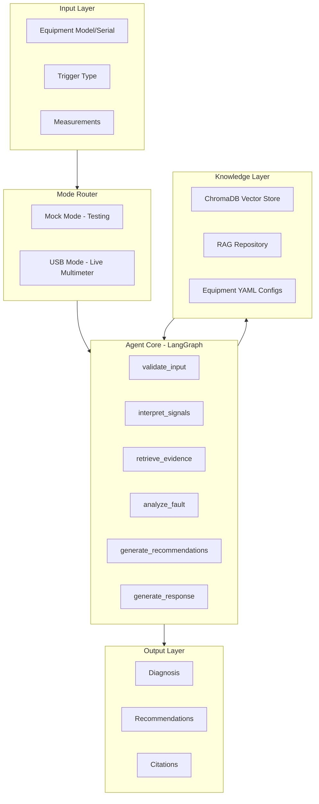
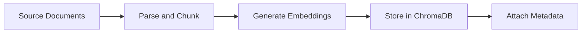

# Project Context for AI Assistants

> This document provides comprehensive context for AI assistants working on the Biomedical Equipment Troubleshooting AI Agent project.

---

## 1. Project Overview

### 1.1 Purpose

The Biomedical Equipment Troubleshooting AI Agent is an intelligent diagnostic system designed to assist biomedical engineers in troubleshooting medical equipment. The system uses a combination of rule-based logic and Retrieval Augmented Generation (RAG) to provide structured diagnostic recommendations.

### 1.2 Technology Stack

| Component | Technology |
|-----------|------------|
| Workflow Orchestration | LangGraph |
| Vector Database | ChromaDB |
| Embeddings | OpenAI/Sentence Transformers |
| LLM Integration | Groq (Llama models) |
| Language | Python 3.11+ |
| Configuration | YAML-based equipment configs |

### 1.3 Target Users

- **Primary**: Biomedical engineers troubleshooting medical equipment
- **Secondary**: Field technicians performing routine maintenance
- **Tertiary**: Equipment manufacturers creating diagnostic documentation

### 1.4 Key Design Principles

1. **Deterministic Behavior**: All diagnostic logic is traceable and reproducible
2. **Equipment-Agnostic Core**: No hard-coded equipment logic in code; all knowledge comes from configuration files
3. **RAG-Enhanced Reasoning**: LLM reasoning is augmented with retrieved documentation
4. **Safety-First**: All recommendations include safety warnings and verification steps

---

## 2. Architecture Summary

### 2.1 System Architecture



### 2.2 Component Responsibilities

#### Input Layer
- **Equipment Model/Serial**: Identifies the equipment being diagnosed
- **Trigger Type**: `initial`, `follow_up`, or `verification`
- **Measurements**: Signal values from test points

#### Mode Router
- **Mock Mode**: Uses pre-defined signal scenarios for testing
- **USB Mode**: Interfaces with real multimeter hardware

#### Agent Core (LangGraph Nodes)

| Node | Input | Output | Purpose |
|------|-------|--------|---------|
| [`validate_input()`](src/application/agent.py:89) | Raw request | Validated state | Check required fields, determine workflow type |
| [`interpret_signals()`](src/application/agent.py:123) | Measurements | Semantic states | Convert raw values to semantic states using equipment thresholds |
| [`retrieve_evidence()`](src/application/agent.py:193) | Query, equipment | Documents | RAG retrieval from ChromaDB |
| [`analyze_fault()`](src/application/agent.py:236) | Signal states, evidence | Hypothesis | Match fault patterns, generate diagnosis |
| [`generate_recommendations()`](src/application/agent.py:355) | Hypothesis | Actions | Generate recovery steps from equipment config |
| [`generate_response()`](src/application/agent.py:419) | All analysis | Structured response | Format final output per I/O contract |

#### Knowledge Layer
- **ChromaDB**: Vector storage for diagnostic documentation
- **RAG Repository**: Retrieval interface with fallback to static rules
- **Equipment Configs**: YAML files containing equipment-specific knowledge

---

## 3. RAG Pipeline

### 3.1 Document Ingestion

Documents are ingested via [`scripts/ingest_knowledge.py`](scripts/ingest_knowledge.py):



### 3.2 Retrieval Process

The [`RAGRepository`](src/infrastructure/rag_repository.py:33) handles retrieval:

```python
# Key retrieval parameters
query = "troubleshoot power supply"  # Natural language query
equipment_model = "cctv-psu-24w-v1"  # Equipment filter
top_k = 5  # Number of results

# Retrieval uses semantic similarity
results = rag.retrieve(query, equipment_model, top_k)
```

### 3.3 Document Schema

Each document chunk stored in ChromaDB includes:

| Field | Type | Purpose |
|-------|------|---------|
| `id` | string | Unique identifier (e.g., `SIG-001`, `MEAS-003`) |
| `document` | string | The text content |
| `metadata.title` | string | Diagnostic-centric title |
| `metadata.category` | string | Section category |
| `metadata.equipment_model` | string | Equipment filter |

### 3.4 Fallback Mechanism

When RAG is unavailable, the system falls back to [`StaticRuleRepository`](src/infrastructure/rag_repository.py:134):

```python
# Static rules provide deterministic fallback
rules = static_repo.find_matching_rules(equipment_model, signal_patterns)
```

---

## 4. Current Equipment

### 4.1 CCTV-PSU-24W-V1

**Description**: 12V 30A Switched-Mode Power Supply for CCTV systems

**Configuration File**: [`data/equipment/cctv-psu-24w-v1.yaml`](data/equipment/cctv-psu-24w-v1.yaml)

#### Key Signals

| Signal ID | Name | Test Point | Parameter |
|-----------|------|------------|-----------|
| `ac_input` | AC Input Voltage | AC_IN | voltage_rms |
| `bridge_output` | Bridge Rectifier Output | TP1 | voltage_dc |
| `output_12v` | 12V Output Rail | TP2 | voltage_dc |
| `feedback_ref` | Feedback Reference | TP3 | voltage_dc |
| `output_current` | Output Current | I_OUT | current |
| `u5_temperature` | U5 Case Temperature | U5 | temperature |

#### Defined Faults

| Fault ID | Name | Primary Component |
|----------|------|-------------------|
| `output_rail_collapse` | Output Rail Collapse | U5 (Buck converter) |
| `overvoltage_output` | Overvoltage Output | R2 (Feedback resistor) |
| `thermal_shutdown` | Thermal Shutdown | U5 (Thermal management) |
| `excessive_ripple` | Excessive Output Ripple | C12 (Output capacitor) |
| `primary_side_failure` | Primary Side Input Fault | F1 (Input fuse) |

### 4.2 Mock Signals

Test scenarios are defined in [`data/mock_signals/`](data/mock_signals/):

| File | Scenario |
|------|----------|
| `cctv-psu-output-rail.json` | Output rail collapse |
| `cctv-psu-overvoltage.json` | Overvoltage condition |
| `cctv-psu-ripple.json` | Excessive ripple |
| `cctv-psu-thermal.json` | Thermal shutdown |
| `scenarios.json` | All scenario definitions |

---

## 5. Documentation Requirements for RAG

### 5.1 Document Atomization

Documents should be **atomized** - one concept per chunk. This improves retrieval precision.

**Good Example**:
```markdown
## SIG-001: Unit Completely Dead — No LED, No Fan, No Output

**Symptom Class:** Total Power Failure
**Observable:** No indication of any electrical activity
**First Test:** DC Bus Voltage
**Expected If Fault Here:** 0V on bulk capacitor
```

**Bad Example**:
```markdown
## Troubleshooting Guide

The power supply may fail due to various reasons including blown fuses, 
failed MOSFETs, capacitor degradation, or feedback loop issues. 
To troubleshoot, first check the fuse, then measure DC bus...
```

### 5.2 Diagnostic-Centric Titles

Titles should be **searchable and diagnostic-focused**:

| Good Title | Poor Title |
|------------|------------|
| `SIG-001: Unit Completely Dead — No LED, No Fan, No Output` | `Power Supply Issues` |
| `MEAS-003: MOSFET Drain-Source Resistance` | `Testing Components` |
| `COMP-001: Primary MOSFET Fault Model` | `About MOSFETs` |

### 5.3 Probability Weights

Include **probability weights** for different fault causes:

```markdown
**Root Cause Candidates:**
- MOSFET Drain-Source short (60%)
- Bridge rectifier diode short (25%)
- Bulk capacitor internal short (10%)
- Primary winding short to core (5%)
```

### 5.4 Measurement Rules

Include **measurement rules** with expected values:

```markdown
## MEAS-001: DC Bus Voltage Measurement

**Test Point:** Bulk electrolytic capacitor positive to negative terminal
**Expected Values:**
- 115VAC input: 155–165V DC
- 230VAC input: 310–330V DC

**Decision Logic:**
| Result | Interpretation | Next Action |
|--------|----------------|-------------|
| Normal (155V/310V) | Input, fuse, rectifier, bulk cap OK | Test switching stage |
| Zero | Primary side fault | Test fuse, rectifier, bulk cap |
```

### 5.5 Causality Chains

Document **nth-order failure propagations**:

```markdown
## CAUS-005: Secondary Diode Short — Cascade Chain

SECONDARY DIODE SHORTS
  └─► Transformer secondary effectively shorted
      └─► Reflected impedance to primary drops
          └─► Primary current increases
              └─► MOSFET thermal stress increases
                  └─► MOSFET failure
```

### 5.6 Ambiguity Resolution

Include **differentiation tests** for similar symptoms:

```markdown
## AMB-001: Differentiating Causes of Output Cycling/Hiccup

| Test | Result | Indicates |
|------|--------|-----------|
| Disconnect load | Cycling stops | Load overload or short |
| Disconnect load | Cycling continues | Internal PSU fault |
| DC bus during cycling | Stable 155/310V | Feedback or controller issue |
| DC bus during cycling | Droops significantly | Bulk capacitor fault |
```

---

## 6. File Structure Reference

```
ai-agent/
├── data/
│   ├── equipment/           # Equipment YAML configurations
│   │   └── cctv-psu-24w-v1.yaml
│   ├── knowledge/           # Source documents for RAG
│   │   └── README.md
│   ├── mock_signals/        # Test scenarios
│   │   ├── scenarios.json
│   │   └── cctv-psu-*.json
│   └── chromadb/            # Vector database (generated)
├── docs/
│   ├── agent_io_contract.md     # Input/output specification
│   ├── agent_scope.md           # Scope and limitations
│   ├── equipment_schema.md      # Equipment config schema
│   ├── signal_schema.md         # Signal measurement schema
│   └── langgraph_design.md      # LangGraph workflow design
├── scripts/
│   └── ingest_knowledge.py      # Document ingestion script
├── src/
│   ├── application/
│   │   └── agent.py             # LangGraph agent implementation
│   ├── domain/
│   │   └── models.py            # Domain models
│   ├── infrastructure/
│   │   ├── rag_repository.py    # RAG retrieval
│   │   ├── chromadb_client.py   # ChromaDB interface
│   │   ├── equipment_config.py  # Equipment config loader
│   │   └── llm_client.py        # LLM integration
│   └── interfaces/
│       ├── cli.py               # CLI interface
│       └── mode_router.py       # Mock/USB mode routing
└── OtherAI-Discussions/
    ├── Claude Opus 4.5 response.md
    └── GPT-5.2 response.md
```

---

## 7. Key Interfaces

### 7.1 Agent Input Contract

```python
{
    "equipment_model": "cctv-psu-24w-v1",
    "equipment_serial": "SN12345",
    "trigger_type": "initial",
    "trigger_content": "Unit not powering on",
    "measurements": [
        {
            "test_point": "TP2",
            "value": 0.2,
            "unit": "V"
        }
    ]
}
```

### 7.2 Agent Output Contract

```python
{
    "version": "1.0",
    "session_id": "uuid",
    "equipment_context": {
        "model": "cctv-psu-24w-v1",
        "serial": "SN12345"
    },
    "diagnosis": {
        "primary_cause": "Buck converter IC has failed",
        "confidence_score": 0.85,
        "contributing_factors": [],
        "signal_evidence": {
            "matching_signals": [...],
            "conflicting_signals": []
        }
    },
    "recommendations": [...],
    "citations": [...],
    "reasoning_chain": [...],
    "limitations": {...}
}
```

---

## 8. Development Guidelines

### 8.1 Adding New Equipment

1. Create YAML config in `data/equipment/`
2. Define signals, thresholds, faults, and recovery steps
3. Create mock signals for testing in `data/mock_signals/`
4. Add diagnostic documentation to `data/knowledge/`
5. Run ingestion script to update ChromaDB

### 8.2 Modifying Diagnostic Logic

- **DO NOT** add equipment-specific logic to code files
- **DO** add new fault definitions to equipment YAML
- **DO** add new measurement rules to documentation

### 8.3 Improving RAG Retrieval

1. Ensure documents are atomized (one concept per chunk)
2. Use diagnostic-centric titles with stable IDs
3. Include probability weights and decision logic
4. Add cross-references between related chunks

---

## 9. References

- [LangGraph Documentation](https://langchain-ai.github.io/langgraph/)
- [ChromaDB Documentation](https://docs.trychroma.com/)
- [Agent I/O Contract](docs/agent_io_contract.md)
- [Equipment Schema](docs/equipment_schema.md)
- [Signal Schema](docs/signal_schema.md)
