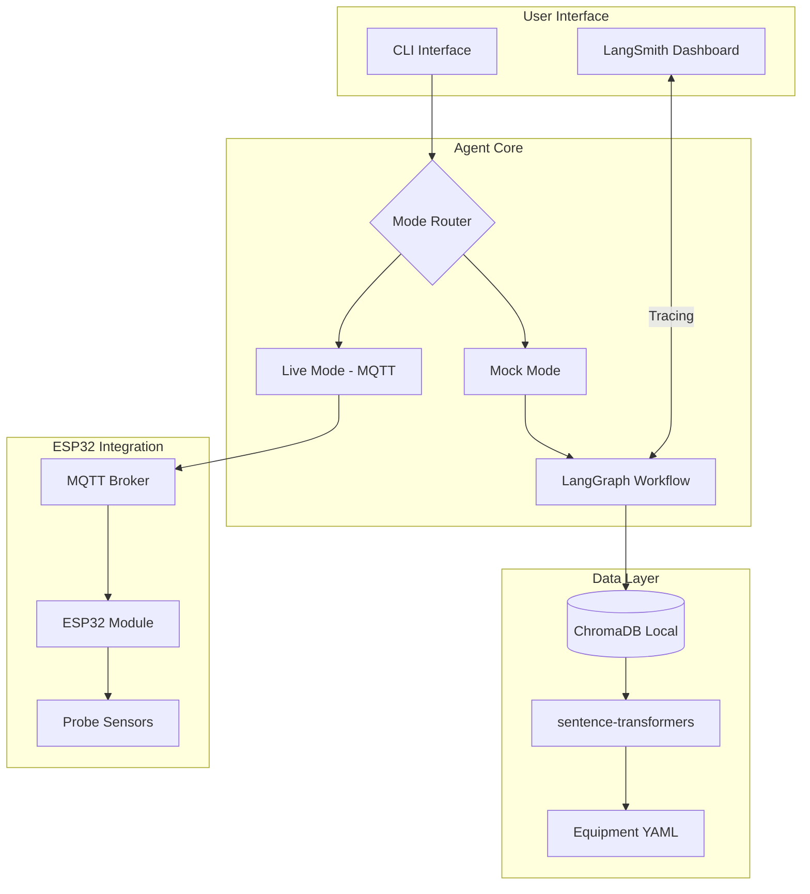
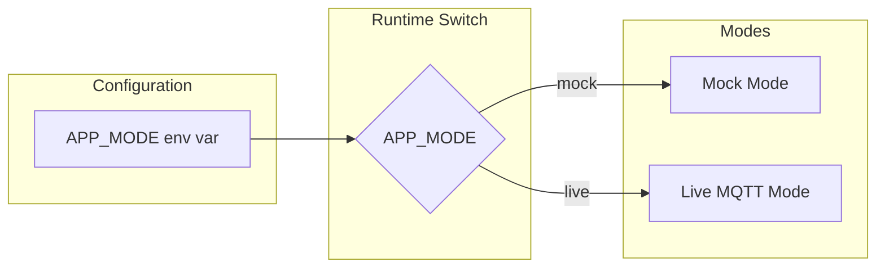

# Biomedical Troubleshooting Agent - Implementation Plan

## Document Overview

This document outlines the complete implementation plan for adding mock/live toggle capability, MQTT integration for ESP32 signals, LangSmith tracing, and mock signal generation to the biomedical troubleshooting agent.

---

## 1. System Architecture

### 1.1 High-Level Architecture



### 1.2 Mode Toggle Architecture



---

## 2. Environment Configuration

### 2.1 Updated .env File Structure

```env
# =============================================================================
# APPLICATION MODE
# =============================================================================
# Options: mock, live
# - mock: Use simulated signals from CCTV PSU demo
# - live: Connect to ESP32 via MQTT for real signals
APP_MODE=mock

# =============================================================================
# MQTT CONFIGURATION (Live Mode Only)
# =============================================================================
MQTT_BROKER_HOST=localhost
MQTT_BROKER_PORT=1883
MQTT_USERNAME=
MQTT_PASSWORD=
MQTT_TOPIC_PREFIX=biomed/signals
MQTT_CLIENT_ID=biomed-agent-laptop

# =============================================================================
# LLM Configuration (Reasoning) - FREE TIER
# =============================================================================
# Groq: https://console.groq.com (truly free, no credit card)
GROQ_API_KEY=gsk_...
LLM_PROVIDER=groq
LLM_MODEL=llama-3.3-70b-versatile

# =============================================================================
# EMBEDDINGS - LOCAL (FREE)
# =============================================================================
# sentence-transformers runs locally on CPU
EMBEDDING_PROVIDER=local
EMBEDDING_MODEL=all-MiniLM-L6-v2

# =============================================================================
# CHROMA DB (LOCAL)
# =============================================================================
CHROMADB_HOST=localhost
CHROMADB_PORT=8000
CHROMADB_COLLECTION=biomed_equipment

# =============================================================================
# LANGSMITH OBSERVABILITY (FREE TIER)
# =============================================================================
# Sign up: https://smith.langchain.com
LANGCHAIN_API_KEY=lsv2_...
LANGCHAIN_PROJECT=biomed-troubleshooter
LANGCHAIN_TRACING=true

# =============================================================================
# APPLICATION SETTINGS
# =============================================================================
APP_ENV=development  # development, production
DEBUG=true
LOG_LEVEL=INFO
```

### 2.2 Dependencies to Add

**File: `requirements.txt`**

```txt
# Biomedical Equipment Troubleshooting Agent

# Core Dependencies
langgraph>=0.0.20
langchain>=0.1.0

# Observability
langsmith>=0.1.0

# Vector Database
chromadb>=0.4.0

# Data Validation
pydantic>=2.0.0

# CLI
click>=8.0.0

# MQTT (ESP32 Integration)
paho-mqtt>=1.6.0

# Local Embeddings (FREE - no API key needed)
sentence-transformers>=2.2.0

# Testing
pytest>=7.0.0
pytest-cov>=4.0.0

# Utilities
python-dateutil>=2.8.0
pyyaml>=6.0
```

---

## 3. Mode Toggle System

### 3.1 Configuration Class

**File: `src/infrastructure/mode_config.py`**

```python
"""
Mode Configuration

Provides mock/live mode toggle functionality for the agent.
"""

import os
from enum import Enum
from dataclasses import dataclass
from typing import Optional


class AgentMode(Enum):
    """Agent operating modes."""
    MOCK = "mock"
    LIVE = "live"


@dataclass
class ModeConfig:
    """Mode configuration."""
    mode: AgentMode
    mock_scenario: str
    mqtt_config: dict

    @classmethod
    def from_env(cls) -> "ModeConfig":
        """Create from environment variables."""
        mode_str = os.environ.get("APP_MODE", "mock").lower()
        mode = AgentMode.MOCK if mode_str == "mock" else AgentMode.LIVE

        return cls(
            mode=mode,
            mock_scenario=os.environ.get("MOCK_SCENARIO", "cctv-psu-output-rail"),
            mqtt_config={
                "host": os.environ.get("MQTT_BROKER_HOST", "localhost"),
                "port": int(os.environ.get("MQTT_BROKER_PORT", 1883)),
                "username": os.environ.get("MQTT_USERNAME"),
                "password": os.environ.get("MQTT_PASSWORD"),
                "client_id": os.environ.get("MQTT_CLIENT_ID", "biomed-agent"),
                "topic_prefix": os.environ.get("MQTT_TOPIC_PREFIX", "biomed/signals")
            }
        )


def get_mode() -> AgentMode:
    """Get current agent mode."""
    return ModeConfig.from_env().mode


def is_mock_mode() -> bool:
    """Check if running in mock mode."""
    return get_mode() == AgentMode.MOCK


def is_live_mode() -> bool:
    """Check if running in live mode."""
    return get_mode() == AgentMode.LIVE
```

### 3.2 Mode Router

**File: `src/interfaces/mode_router.py`**

```python
"""
Mode Router

Routes signal input based on current mode (mock/live).
"""

import json
from abc import ABC, abstractmethod
from typing import Optional
from pathlib import Path

from src.infrastructure.mode_config import ModeConfig, AgentMode
from src.domain.models import SignalBatch


class SignalSource(ABC):
    """Abstract base class for signal sources."""

    @abstractmethod
    def receive_signals(self, equipment_id: str) -> Optional[SignalBatch]:
        """Receive signals for equipment."""
        pass


class MockSignalSource(SignalSource):
    """Mock signal source using predefined scenarios."""

    SCENARIO_PATH = Path("data/mock_signals")

    def __init__(self, scenario_name: str = "cctv-psu-output-rail"):
        self.scenario_name = scenario_name

    def receive_signals(self, equipment_id: str) -> Optional[SignalBatch]:
        """Load mock signals from scenario file."""
        scenario_file = self.SCENARIO_PATH / f"{self.scenario_name}.json"

        if not scenario_file.exists():
            # Fallback to default scenario
            scenario_file = self.SCENARIO_PATH / "cctv-psu-24w-v1.json"

        with open(scenario_file, 'r') as f:
            data = json.load(f)

        return SignalBatch.from_dict(data)


class LiveMQTTSignalSource(SignalSource):
    """Live MQTT signal source for ESP32."""

    def __init__(self, mqtt_config: dict):
        self.mqtt_config = mqtt_config
        self.client = None

    def connect(self) -> None:
        """Connect to MQTT broker."""
        import paho.mqtt.client as mqtt

        self.client = mqtt.Client(
            client_id=self.mqtt_config["client_id"],
            clean_session=True
        )

        if self.mqtt_config["username"]:
            self.client.username_pw_set(
                self.mqtt_config["username"],
                self.mqtt_config["password"]
            )

        self.client.connect(
            self.mqtt_config["host"],
            self.mqtt_config["port"]
        )

        self.client.loop_start()

    def receive_signals(self, equipment_id: str) -> Optional[SignalBatch]:
        """Subscribe to MQTT topic and wait for signals."""
        topic = f"{self.mqtt_config['topic_prefix']}/{equipment_id}"

        # This will be implemented with callback
        # For now, return None and let MQTT callback populate
        return None


class ModeRouter:
    """Routes to appropriate signal source based on mode."""

    def __init__(self):
        self.config = ModeConfig.from_env()

        if self.config.mode == AgentMode.MOCK:
            self.source = MockSignalSource(self.config.mock_scenario)
        else:
            self.source = LiveMQTTSignalSource(self.config.mqtt_config)

    def get_signal_source(self) -> SignalSource:
        """Get the active signal source."""
        return self.source

    def get_mode(self) -> AgentMode:
        """Get current mode."""
        return self.config.mode
```

---

## 4. MQTT Integration for ESP32

### 4.1 MQTT Message Format (ESP32 → Agent)

**Topic: `biomed/signals/{equipment_id}`**

```json
{
  "timestamp": "2026-02-04T14:30:00Z",
  "equipment_id": "CCTV-PSU-24W-V1",
  "signals": [
    {
      "test_point": "TP1",
      "value": 24.0,
      "unit": "V",
      "accuracy": 0.01,
      "measurement_type": "voltage"
    },
    {
      "test_point": "TP2",
      "value": 0.12,
      "unit": "A",
      "accuracy": 0.001,
      "measurement_type": "current"
    }
  ]
}
```

### 4.2 MQTT Client Implementation

**File: `src/infrastructure/mqtt_client.py`**

```python
"""
MQTT Client for ESP32 Signal Reception

Receives probe signals from ESP32 module via MQTT.
"""

import json
import threading
from typing import Optional, Callable
from datetime import datetime

import paho.mqtt.client as mqtt
from pydantic import BaseModel


class MQTTMessage(BaseModel):
    """MQTT message model."""
    timestamp: str
    equipment_id: str
    signals: list


class ESP32MQTTClient:
    """MQTT client for receiving ESP32 signals."""

    def __init__(
        self,
        host: str = "localhost",
        port: int = 1883,
        client_id: str = "biomed-agent",
        username: Optional[str] = None,
        password: Optional[str] = None,
        topic_prefix: str = "biomed/signals"
    ):
        self.host = host
        self.port = port
        self.client_id = client_id
        self.username = username
        self.password = password
        self.topic_prefix = topic_prefix

        self.client = mqtt.Client(
            client_id=client_id,
            clean_session=True
        )

        if username and password:
            self.client.username_pw_set(username, password)

        # Buffer for received messages
        self._message_buffer: dict[str, MQTTMessage] = {}
        self._buffer_lock = threading.Lock()

        # Set up callbacks
        self.client.on_connect = self._on_connect
        self.client.on_message = self._on_message

    def _on_connect(self, client, userdata, flags, rc):
        """Called when connected to broker."""
        if rc == 0:
            print(f"[MQTT] Connected to {self.host}:{self.port}")
            # Subscribe to all equipment topics
            topic = f"{self.topic_prefix}/+"
            client.subscribe(topic)
            print(f"[MQTT] Subscribed to {topic}")
        else:
            print(f"[MQTT] Connection failed with code {rc}")

    def _on_message(self, client, userdata, msg):
        """Called when message is received."""
        try:
            payload = json.loads(msg.payload.decode())
            message = MQTTMessage(**payload)

            with self._buffer_lock:
                self._message_buffer[message.equipment_id] = message

            print(f"[MQTT] Received signals from {message.equipment_id}")

        except json.JSONDecodeError as e:
            print(f"[MQTT] Invalid JSON: {e}")
        except Exception as e:
            print(f"[MQTT] Error processing message: {e}")

    def connect(self) -> bool:
        """Connect to MQTT broker."""
        try:
            self.client.connect(self.host, self.port)
            self.client.loop_start()
            return True
        except Exception as e:
            print(f"[MQTT] Connection error: {e}")
            return False

    def disconnect(self):
        """Disconnect from MQTT broker."""
        self.client.loop_stop()
        self.client.disconnect()

    def get_signals(self, equipment_id: str) -> Optional[MQTTMessage]:
        """Get latest signals for equipment."""
        with self._buffer_lock:
            return self._message_buffer.get(equipment_id)

    def clear_buffer(self, equipment_id: Optional[str] = None):
        """Clear message buffer."""
        with self._buffer_lock:
            if equipment_id:
                self._message_buffer.pop(equipment_id, None)
            else:
                self._message_buffer.clear()
```

---

## 5. LangSmith Tracing Configuration

### 5.1 LangSmith Setup

**File: `src/infrastructure/langsmith_client.py`**

```python
"""
LangSmith Tracing Configuration

Sets up tracing for LangGraph workflow.
"""

import os
from typing import Optional

from langsmith import Client
from langchain.callbacks import LangChainTracer
from langchain_core.runnables import RunnableConfig


def setup_langsmith() -> Optional[LangChainTracer]:
    """Set up LangSmith tracer."""
    api_key = os.environ.get("LANGCHAIN_API_KEY")
    project = os.environ.get("LANGCHAIN_PROJECT", "biomed-troubleshooter")
    tracing_enabled = os.environ.get("LANGCHAIN_TRACING", "true").lower() == "true"

    if not api_key or not tracing_enabled:
        print("[LangSmith] Tracing disabled (no API key)")
        return None

    try:
        tracer = LangChainTracer(
            project_name=project,
        )
        print(f"[LangSmith] Tracing enabled for project: {project}")
        return tracer
    except Exception as e:
        print(f"[LangSmith] Setup failed: {e}")
        return None


def get_runnable_config(
    run_name: str,
    metadata: Optional[dict] = None
) -> RunnableConfig:
    """Get RunnableConfig with LangSmith tracing."""
    tracer = setup_langsmith()

    config = RunnableConfig(
        callbacks=[tracer] if tracer else [],
        run_name=run_name,
        metadata=metadata or {}
    )

    return config
```

### 5.2 LangGraph Integration

**File: `src/application/agent.py` (Update)**

```python
"""
LangGraph Workflow with LangSmith Tracing
"""

from typing import TypedDict, Annotated, List
from langgraph.graph import StateGraph, END
from langchain_core.runnables import RunnableConfig

from src.infrastructure.config import get_langsmith_config
from src.infrastructure.langsmith_client import setup_langsmith


class AgentState(TypedDict):
    """Agent state for LangGraph."""
    trigger_type: str
    trigger_content: str
    equipment_model: str
    equipment_serial: str
    measurements: List[dict]
    signal_batch: dict
    rag_context: List[dict]
    diagnosis: dict
    recommendations: List[str]
    reasoning_chain: List[str]


def create_troubleshooting_graph() -> StateGraph:
    """Create the troubleshooting workflow graph."""

    # Define graph
    graph = StateGraph(AgentState)

    # Add nodes
    graph.add_node("validate_input", validate_input_node)
    graph.add_node("interpret_signals", interpret_signals_node)
    graph.add_node("retrieve_knowledge", retrieve_knowledge_node)
    graph.add_node("analyze_fault", analyze_fault_node)
    graph.add_node("generate_response", generate_response_node)

    # Define edges
    graph.set_entry_point("validate_input")
    graph.add_edge("validate_input", "interpret_signals")
    graph.add_edge("interpret_signals", "retrieve_knowledge")
    graph.add_edge("retrieve_knowledge", "analyze_fault")
    graph.add_edge("analyze_fault", "generate_response")
    graph.add_edge("generate_response", END)

    return graph


def run_diagnostic(
    trigger_type: str,
    trigger_content: str,
    equipment_model: str,
    equipment_serial: str,
    measurements: List[dict],
    config: Optional[RunnableConfig] = None
) -> dict:
    """Run diagnostic workflow."""

    # Set up LangSmith tracing
    langsmith_config = get_langsmith_config()

    if langsmith_config.enabled:
        from langchain.callbacks import LangChainTracer
        tracer = LangChainTracer(
            project_name=langsmith_config.project
        )
    else:
        tracer = None

    # Initialize state
    initial_state = {
        "trigger_type": trigger_type,
        "trigger_content": trigger_content,
        "equipment_model": equipment_model,
        "equipment_serial": equipment_serial,
        "measurements": measurements,
        "signal_batch": {},
        "rag_context": [],
        "diagnosis": {},
        "recommendations": [],
        "reasoning_chain": []
    }

    # Create and run graph
    graph = create_troubleshooting_graph()
    app = graph.compile()

    # Run with tracing
    result = app.invoke(
        initial_state,
        config=RunnableConfig(
            callbacks=[tracer] if tracer else [],
            run_name="troubleshoot_session"
        )
    )

    return result
```

---

## 6. Mock Signal Generator (CCTV PSU Demo)

### 6.1 Mock Scenario: Output Rail Collapse

**File: `data/mock_signals/cctv-psu-output-rail.json`**

```json
{
  "scenario_name": "CCTV PSU Output Rail Collapse",
  "equipment_id": "CCTV-PSU-24W-V1",
  "description": "24V output rail collapsed to 12V, indicating possible load short or regulation failure",
  "difficulty": "easy",
  "signals": [
    {
      "test_point": {
        "id": "TP1",
        "name": "Primary Input",
        "description": "AC mains input voltage"
      },
      "value": 230.0,
      "unit": "V",
      "accuracy": 0.5,
      "measurement_type": "voltage",
      "timestamp": "2026-02-04T14:30:00Z"
    },
    {
      "test_point": {
        "id": "TP2",
        "name": "Output Rail",
        "description": "24V DC output"
      },
      "value": 12.3,
      "unit": "V",
      "accuracy": 0.1,
      "measurement_type": "voltage",
      "timestamp": "2026-02-04T14:30:05Z",
      "anomaly": "collapsed_output"
    },
    {
      "test_point": {
        "id": "TP3",
        "name": "Output Current",
        "description": "Load current draw"
      },
      "value": 0.52,
      "unit": "A",
      "accuracy": 0.01,
      "measurement_type": "current",
      "timestamp": "2026-02-04T14:30:05Z"
    }
  ],
  "expected_diagnosis": {
    "primary_cause": "Output rail collapsed - possible load short or regulation failure",
    "confidence": "high",
    "recommended_actions": [
      "Check for short on output terminals",
      "Verify output capacitor integrity",
      "Check IC regulation circuitry"
    ]
  }
}
```

### 6.2 Mock Signal Generator Class

**File: `src/infrastructure/mock_generator.py`**

```python
"""
Mock Signal Generator

Generates simulated probe signals for testing.
"""

import json
from pathlib import Path
from typing import List, Optional
from datetime import datetime

from src.domain.models import Signal, SignalBatch, TestPoint


class MockSignalGenerator:
    """Generates mock signals for demonstration and testing."""

    SCENARIO_PATH = Path("data/mock_signals")

    SCENARIOS = {
        "cctv-psu-output-rail": "CCTV PSU Output Rail Collapse",
        "cctv-psu-overvoltage": "CCTV PSU Overvoltage Condition",
        "cctv-psu-ripple": "CCTV PSU Ripple and Noise",
        "cctv-psu-thermal": "CCTV PSU Thermal Shutdown"
    }

    def __init__(self, scenario: str = "cctv-psu-output-rail"):
        self.scenario = scenario

    def generate_signal_batch(self, equipment_id: str = "CCTV-PSU-24W-V1") -> SignalBatch:
        """Generate a signal batch from predefined scenarios."""

        # Load scenario file if exists
        scenario_file = self.SCENARIO_PATH / f"{self.scenario}.json"

        if scenario_file.exists():
            with open(scenario_file, 'r') as f:
                data = json.load(f)
            return SignalBatch.from_dict(data)

        # Fallback: Generate from built-in scenarios
        return self._generate_builtin_scenario(equipment_id)

    def _generate_builtin_scenario(self, equipment_id: str) -> SignalBatch:
        """Generate built-in scenario signals."""

        timestamp = datetime.utcnow().isoformat()

        if self.scenario == "cctv-psu-output-rail":
            signals = [
                Signal(
                    test_point=TestPoint(id="TP1", name="Primary Input"),
                    value=230.0,
                    unit="V",
                    accuracy=0.5,
                    measurement_type="voltage",
                    timestamp=timestamp
                ),
                Signal(
                    test_point=TestPoint(id="TP2", name="Output Rail"),
                    value=12.3,  # Collapsed from 24V
                    unit="V",
                    accuracy=0.1,
                    measurement_type="voltage",
                    timestamp=timestamp
                ),
                Signal(
                    test_point=TestPoint(id="TP3", name="Output Current"),
                    value=0.52,
                    unit="A",
                    accuracy=0.01,
                    measurement_type="current",
                    timestamp=timestamp
                )
            ]

        elif self.scenario == "cctv-psu-overvoltage":
            signals = [
                Signal(
                    test_point=TestPoint(id="TP1", name="Primary Input"),
                    value=230.0,
                    unit="V",
                    accuracy=0.5,
                    measurement_type="voltage",
                    timestamp=timestamp
                ),
                Signal(
                    test_point=TestPoint(id="TP2", name="Output Rail"),
                    value=28.5,  # Overvoltage (should be 24V)
                    unit="V",
                    accuracy=0.1,
                    measurement_type="voltage",
                    timestamp=timestamp
                )
            ]

        else:
            # Default: Normal operation
            signals = [
                Signal(
                    test_point=TestPoint(id="TP1", name="Primary Input"),
                    value=230.0,
                    unit="V",
                    accuracy=0.5,
                    measurement_type="voltage",
                    timestamp=timestamp
                ),
                Signal(
                    test_point=TestPoint(id="TP2", name="Output Rail"),
                    value=24.0,
                    unit="V",
                    accuracy=0.1,
                    measurement_type="voltage",
                    timestamp=timestamp
                )
            ]

        return SignalBatch(
            timestamp=timestamp,
            equipment_id=equipment_id,
            signals=signals
        )

    def list_scenarios(self) -> List[str]:
        """List available scenarios."""
        return list(self.SCENARIOS.keys())
```

---

## 7. CLI Updates for Mode Toggle

### 7.1 Updated CLI Commands

**File: `src/interfaces/cli.py` (Add new commands)**

```python
"""
CLI Interface - Updated with Mock/Live Mode Toggle
"""

import argparse
import json
from pathlib import Path

from src.interfaces.mode_router import ModeRouter, AgentMode
from src.infrastructure.mock_generator import MockSignalGenerator
from src.application.agent import run_diagnostic


def run_mock_mode(scenario: str = "cctv-psu-output-rail"):
    """Run agent in mock mode with predefined scenario."""

    print("\n" + "=" * 60)
    print("BIOMEDICAL TROUBLESHOOTING AGENT - MOCK MODE")
    print("=" * 60)

    # Get mode info
    router = ModeRouter()
    mode = router.get_mode()

    print(f"Current Mode: {mode.value}")
    print(f"Scenario: {scenario}")
    print()

    # Generate mock signals
    generator = MockSignalGenerator(scenario)
    signal_batch = generator.generate_signal_batch()

    print("Generated Signals:")
    for sig in signal_batch.signals:
        print(f"  {sig.test_point.id}: {sig.value} {sig.unit}")
    print()

    # Run diagnostic
    result = run_diagnostic(
        trigger_type="mock_signal",
        trigger_content=f"Mock scenario: {scenario}",
        equipment_model=signal_batch.equipment_id,
        equipment_serial="MOCK-001",
        measurements=[
            {"test_point": s.test_point.id, "value": s.value, "unit": s.unit}
            for s in signal_batch.signals
        ]
    )

    print("\n" + "=" * 60)
    print("DIAGNOSIS RESULT")
    print("=" * 60)
    print(json.dumps(result, indent=2))

    return result


def run_live_mode(equipment_id: str):
    """Run agent in live MQTT mode."""

    print("\n" + "=" * 60)
    print("BIOMEDICAL TROUBLESHOOTING AGENT - LIVE MODE")
    print("=" * 60)
    print(f"Waiting for signals from: {equipment_id}")
    print("Press Ctrl+C to exit")
    print()

    # Import and connect MQTT client
    from src.infrastructure.mqtt_client import ESP32MQTTClient

    router = ModeRouter()
    config = router.config

    mqtt_client = ESP32MQTTClient(
        host=config.mqtt_config["host"],
        port=config.mqtt_config["port"],
        client_id=config.mqtt_config["client_id"],
        username=config.mqtt_config.get("username"),
        password=config.mqtt_config.get("password"),
        topic_prefix=config.mqtt_config["topic_prefix"]
    )

    if not mqtt_client.connect():
        print("[ERROR] Failed to connect to MQTT broker")
        return

    try:
        import signal
        from datetime import datetime, timedelta

        timeout = timedelta(seconds=60)
        start_time = datetime.now()

        while datetime.now() - start_time < timeout:
            signals = mqtt_client.get_signals(equipment_id)

            if signals:
                print(f"\n[RECEIVED] Signals from {equipment_id}")

                # Run diagnostic
                result = run_diagnostic(
                    trigger_type="mqtt_signal",
                    trigger_content="Live MQTT signal",
                    equipment_model=equipment_id,
                    equipment_serial="LIVE-001",
                    measurements=[
                        {"test_point": s["test_point"], "value": s["value"], "unit": s["unit"]}
                        for s in signals.signals
                    ]
                )

                print("\n" + "=" * 60)
                print("DIAGNOSIS RESULT")
                print("=" * 60)
                print(json.dumps(result, indent=2))

                mqtt_client.clear_buffer(equipment_id)

            signal.pause()

    except KeyboardInterrupt:
        print("\n[EXIT] Interrupted by user")
    finally:
        mqtt_client.disconnect()


def mode_status():
    """Display current mode configuration."""
    router = ModeRouter()
    config = router.config

    print("\n" + "=" * 60)
    print("MODE STATUS")
    print("=" * 60)
    print(f"Current Mode: {config.mode.value}")
    print(f"Mock Scenario: {config.mock_scenario}")
    print()

    if config.mode == AgentMode.LIVE:
        print("MQTT Configuration:")
        print(f"  Broker: {config.mqtt_config['host']}:{config.mqtt_config['port']}")
        print(f"  Topic Prefix: {config.mqtt_config['topic_prefix']}")
    else:
        print("Mock Configuration:")
        generator = MockSignalGenerator(config.mock_scenario)
        print(f"  Available Scenarios:")
        for name in generator.list_scenarios():
            print(f"    - {name}")


def main():
    """Main CLI entry point."""
    parser = argparse.ArgumentParser(
        description="Biomedical Equipment Troubleshooting Agent"
    )

    # Mode commands
    parser.add_argument(
        "--mock", "-M",
        const="cctv-psu-output-rail",
        nargs="?",
        metavar="SCENARIO",
        help="Run in mock mode with optional scenario name"
    )
    parser.add_argument(
        "--live", "-L",
        metavar="EQUIPMENT_ID",
        help="Run in live MQTT mode for equipment"
    )
    parser.add_argument(
        "--status",
        action="store_true",
        help="Show current mode configuration"
    )

    # Existing commands (keep for backward compatibility)
    parser.add_argument(
        "--interactive", "-i",
        action="store_true",
        help="Run in interactive mode"
    )
    parser.add_argument(
        "--scenario", "-s",
        type=str,
        help="Replay a scenario from JSON file"
    )

    args = parser.parse_args()

    if args.mock is not None:
        run_mock_mode(args.mock)
    elif args.live:
        run_live_mode(args.live)
    elif args.status:
        mode_status()
    elif args.interactive:
        interactive_mode()
    elif args.scenario:
        scenario_replay(args.scenario)
    else:
        parser.print_help()


if __name__ == "__main__":
    main()
```

---

## 8. Complete Workflow Verification Procedure

### 8.1 Pre-Flight Checklist

```bash
# 1. Start ChromaDB
docker run -p 8000:8000 chromadb/chroma

# 2. Verify .env configuration
cat .env

# 3. Install dependencies
pip install -r requirements.txt

# 4. Test LangSmith connection
python -c "from src.infrastructure.langsmith_client import setup_langsmith; setup_langsmith()"
```

### 8.2 Mock Mode Verification

```bash
# Run mock mode with output rail collapse scenario
python -m src.interfaces.cli --mock cctv-psu-output-rail

# Expected output:
# 1. Signals generated:
#    - TP1: 230.0 V (Primary Input)
#    - TP2: 12.3 V (Collapsed Output)
#    - TP3: 0.52 A (Output Current)
#
# 2. LangSmith traces appear in dashboard
#
# 3. Diagnosis result:
#    - Primary cause: Output rail collapsed
#    - Confidence: high
#    - Recommended actions listed
```

### 8.3 Live Mode Verification (After ESP32 Setup)

```bash
# Start listening for ESP32 signals
python -m src.interfaces.cli --live CCTV-PSU-24W-V1

# ESP32 publishes to: biomed/signals/CCTV-PSU-24W-V1
# Agent receives signals and runs diagnostic
# Results displayed and sent to LangSmith
```

---

## 9. ESP32 Configuration

### 9.1 ESP32 Code (Arduino C++)

```cpp
/*
 * ESP32 Biomedical Equipment Signal Publisher
 * Publishes probe measurements to MQTT broker
 */

#include <WiFi.h>
#include <PubSubClient.h>
#include <ArduinoJson.h>

// WiFi credentials
const char* ssid = "your_wifi_ssid";
const char* password = "your_wifi_password";

// MQTT broker
const char* mqtt_server = "your_mqtt_broker_ip";
const int mqtt_port = 1883;
const char* mqtt_topic = "biomed/signals/CCTV-PSU-24W-V1";

WiFiClient espClient;
PubSubClient client(espClient);

void setup() {
    Serial.begin(115200);
    setup_wifi();
    client.setServer(mqtt_server, mqtt_port);
}

void loop() {
    if (!client.connected()) {
        reconnect();
    }
    client.loop();

    // Read analog signals (example using ADC)
    float voltage = readVoltage();
    float current = readCurrent();

    // Publish signal batch
    publishSignals(voltage, current);

    delay(5000);  // Publish every 5 seconds
}

void publishSignals(float voltage, float current) {
    StaticJsonDocument<256> doc;

    doc["timestamp"] = String(millis());
    doc["equipment_id"] = "CCTV-PSU-24W-V1";

    JsonArray signals = doc.createNestedArray("signals");

    JsonObject voltageSignal = signals.createNestedObject();
    voltageSignal["test_point"] = "TP2";
    voltageSignal["value"] = voltage;
    voltageSignal["unit"] = "V";
    voltageSignal["measurement_type"] = "voltage";

    JsonObject currentSignal = signals.createNestedObject();
    currentSignal["test_point"] = "TP3";
    currentSignal["value"] = current;
    currentSignal["unit"] = "A";
    currentSignal["measurement_type"] = "current";

    char buffer[256];
    serializeJson(doc, buffer);
    client.publish(mqtt_topic, buffer);
}
```

---

## 10. Summary of Changes Required

### Files to Create

| File | Purpose |
|------|---------|
| `src/infrastructure/mode_config.py` | Mode configuration classes |
| `src/interfaces/mode_router.py` | Mock/Live signal routing |
| `src/infrastructure/mqtt_client.py` | MQTT client for ESP32 |
| `src/infrastructure/mock_generator.py` | Mock signal generation |
| `data/mock_signals/cctv-psu-output-rail.json` | Demo scenario |
| `data/mock_signals/cctv-psu-overvoltage.json` | Demo scenario |

### Files to Modify

| File | Change |
|------|--------|
| `requirements.txt` | Add sentence-transformers, paho-mqtt |
| `.env.example` | Add mode, MQTT, local embedding config |
| `src/infrastructure/config.py` | Add mode config loading |
| `src/application/agent.py` | Add LangSmith tracing |
| `src/interfaces/cli.py` | Add --mock, --live, --status commands |

### New Dependencies

```
sentence-transformers>=2.2.0  # Local embeddings (FREE)
paho-mqtt>=1.6.0             # MQTT client for ESP32
```

---

## 11. Estimated Implementation Time

This implementation is designed to be completed in **2-3 coding sessions**:

1. **Session 1:** Environment setup, dependencies, mode toggle system
2. **Session 2:** Mock signal generator, CLI updates, LangSmith integration
3. **Session 3:** MQTT integration, ESP32 testing, documentation

---

**Document Version:** 1.0
**Created:** 2026-02-04
**Author:** AI Architect
