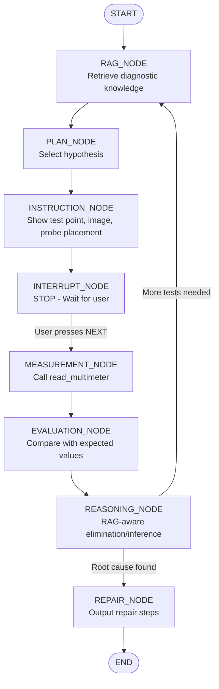
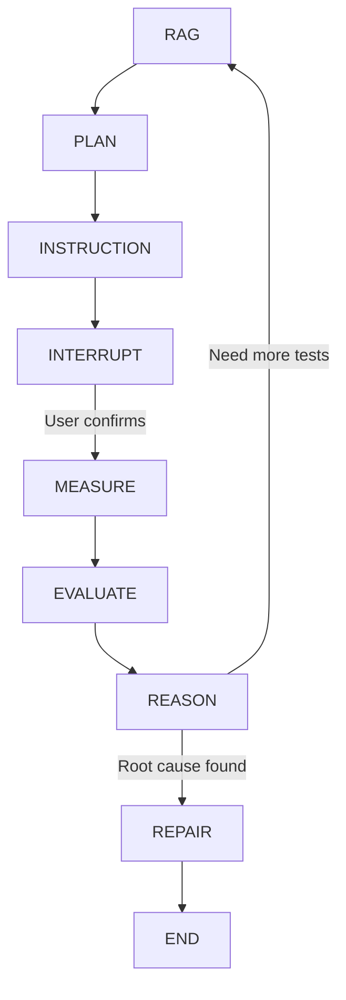

# Diagnostic Agent Refactoring Plan

## Executive Summary

This document outlines the refactoring of the LangGraph-based troubleshooting agent to fix 7 critical issues and implement the correct diagnostic flow with proper human-in-the-loop control.

## Current Problems Analysis

| # | Problem | Current Behavior | Required Behavior |
|---|---------|------------------|-------------------|
| 1 | Instructions hidden when tool calls OFF | Tool output only visible when "Show Tool Calls" is ON | Instructions must be in agent response, not just tool output |
| 2 | Interrupt placed incorrectly | Measure → Interrupt | Instruction → Interrupt → Measure |
| 3 | Agent auto-advances | After measurement, continues without pause | MUST pause after EVERY measurement |
| 4 | No root cause reasoning | Stops at symptom detection | Must trace upstream to root cause via RAG |
| 5 | Wrong termination | Shows "Press NEXT" after repair | Repair is terminal - ends execution |
| 6 | Duplicate images | No tracking | Track displayed_images, show each once |
| 7 | Weak state tracking | Basic step counter | Full tracking: tested_points, eliminated_faults, etc. |

## Correct Diagnostic Flow



## New AgentState Structure

```python
@dataclass
class DiagnosticAgentState:
    """Structured state for diagnostic workflow."""
    
    # === INPUT ===
    messages: Annotated[list[BaseMessage], add_messages] = field(default_factory=list)
    equipment_model: str = ""
    trigger_content: str = ""  # User's problem description
    
    # === PROGRESS TRACKING ===
    current_step: int = 1
    total_steps: int = 10
    
    # === TEST POINT TRACKING ===
    current_test_point: str = ""
    tested_points: list[str] = field(default_factory=list)  # All test points measured
    
    # === FAULT TRACKING ===
    suspected_faults: list[dict] = field(default_factory=list)  # Hypotheses being tested
    eliminated_faults: list[dict] = field(default_factory=list)  # Faults ruled out by measurements
    confirmed_fault: dict = field(default_factory=dict)  # Root cause confirmed
    
    # === MEASUREMENTS ===
    measurements: dict = field(default_factory=dict)  # test_point -> {value, unit, status}
    
    # === IMAGE TRACKING ===
    displayed_images: list[str] = field(default_factory=list)  # URLs already shown
    
    # === FLOW CONTROL ===
    awaiting_user_input: bool = False
    diagnosis_complete: bool = False
    repair_initiated: bool = False
    
    # === RAG CONTEXT ===
    current_hypothesis: dict = field(default_factory=dict)
    rag_evidence: list[dict] = field(default_factory=list)
    reasoning_chain: list[dict] = field(default_factory=list)
```

## Node Designs

### 1. RAG_NODE
**Purpose**: Retrieve relevant diagnostic knowledge from RAG

**Inputs**: equipment_model, trigger_content, current_hypothesis

**Outputs**: rag_evidence, suspected_faults (ranked by probability)

**Logic**:
```
1. Query RAG with:
   - User's symptom description
   - Equipment model
   - Previous measurement results (if any)
   
2. Retrieve top-k relevant documents

3. Parse fault definitions from evidence:
   - Extract fault signatures
   - Extract hypotheses (ranked by confidence)
   - Extract test points to verify each hypothesis

4. Return ranked list of suspected faults
```

### 2. PLAN_NODE
**Purpose**: Select next hypothesis and test point based on RAG results

**Inputs**: suspected_faults, eliminated_faults, measurements

**Outputs**: current_hypothesis, current_test_point, total_steps

**Logic**:
```
1. If no current_hypothesis:
   - Select highest-ranked fault from suspected_faults
   
2. Determine test point for current hypothesis:
   - Look at first signature in fault definition
   - Check if test point already tested (skip if in tested_points)
   
3. If all test points for current hypothesis tested:
   - Move to next hypothesis in suspected_faults
   
4. Update total_steps based on remaining hypotheses
```

### 3. INSTRUCTION_NODE
**Purpose**: Generate ALL user-visible instructions (NOT in tool output)

**Inputs**: current_test_point, current_hypothesis, displayed_images

**Outputs**: messages (with instruction text), pending_test_point

**Logic**:
```
1. Get test point details from equipment config:
   - name
   - physical_description
   - image_url
   - expected_values
   - probe_placement
   - multimeter_mode

2. Check if image already displayed:
   - If image_url in displayed_images: skip image
   - Otherwise: add to displayed_images

3. Generate instruction message:
   - WHY: "Testing [test point] to verify [hypothesis]"
   - WHAT: Test point name and location
   - IMAGE: Markdown image if not duplicate
   - HOW: Exact probe placement instructions
   - SETTINGS: Multimeter mode (voltage/resistance/etc.)

4. Return message that user sees regardless of "Show Tool Calls" setting
```

### 4. INTERRUPT_NODE
**Purpose**: STOP execution BEFORE measurement, wait for user

**Inputs**: pending_test_point, current_hypothesis

**Outputs**: awaiting_user_input = True

**Logic**:
```
1. Use langgraph.types.interrupt() to pause

2. Pass instruction to user:
   - "I need you to measure [test point]"
   - "Press NEXT when ready to measure"
   
3. DO NOT proceed to MEASUREMENT_NODE until interrupt resumes

4. This ensures:
   - No auto-execution
   - User can prepare probes
   - Full control over timing
```

### 5. MEASUREMENT_NODE
**Purpose**: Call read_multimeter ONLY after interrupt resumes

**Inputs**: pending_test_point, equipment_model

**Outputs**: measurement result added to measurements

**Logic**:
```
1. This node ONLY executes AFTER interrupt resumes

2. Call read_multimeter tool:
   - test_point_id = pending_test_point
   - equipment_model from state
   
3. Add result to measurements dict:
   - measurements[test_point] = {
       "value": reading.value,
       "unit": reading.unit,
       "timestamp": now,
       "is_stable": reading.is_stable
     }
   
4. Add test_point to tested_points list
```

### 6. EVALUATION_NODE
**Purpose**: Interpret measurement against expected values

**Inputs**: measurements, current_test_point, current_hypothesis

**Outputs**: evaluation_result (normal/abnormal), evaluation_reasoning

**Logic**:
```
1. Get expected values for test point from equipment config:
   - nominal_value
   - tolerance_percent
   - states (normal, over_voltage, under_voltage, etc.)

2. Compare actual measurement:
   - Within tolerance: status = "normal"
   - Above max: status = "abnormal"
   - Below min: status = "abnormal"
   
3. Generate evaluation reasoning:
   - "Output voltage 28.5V exceeds nominal 24V by 18.7%"
   - "This indicates overvoltage condition"
```

### 7. REASONING_NODE
**Purpose**: RAG-aware elimination and upstream inference

**Inputs**: evaluation_result, measurements, current_hypothesis, tested_points

**Outputs**: eliminated_faults, next_action (continue/repair)

**Logic**:
```
IF evaluation_result is NORMAL:
   1. Query RAG: "what could cause normal readings if fault X is present?"
   2. If RAG indicates this rules out current hypothesis:
      - Add current_hypothesis to eliminated_faults
      - Mark reason: "Measurement at {test_point} was normal, ruling out {hypothesis}"
      - Return "continue" (go to RAG_NODE for next hypothesis)
   3. Otherwise:
      - Return "continue" (test next point for same hypothesis)

IF evaluation_result is ABNORMAL:
   1. Query RAG: "what could cause {abnormal_value} at {test_point}?"
   2. Extract upstream causes from RAG response
   3. Add to suspected_faults (new hypotheses)
   4. If confidence > 0.85 for root cause:
      - Set confirmed_fault = current_hypothesis
      - Return "repair"
   5. Otherwise:
      - Return "continue" (test next point)
```

### 8. REPAIR_NODE (TERMINAL)
**Purpose**: Output confirmed fault and repair steps

**Inputs**: confirmed_fault, measurements, reasoning_chain

**Outputs**: diagnosis_complete = True, repair_message

**Logic**:
```
1. Generate final diagnosis message:
   - "ROOT CAUSE IDENTIFIED: {fault_name}"
   - "Root cause: {cause_description}"
   - "Evidence: {measurement evidence}"
   
2. Retrieve recovery steps from equipment config:
   - Load recovery steps for confirmed_fault.fault_id
   
3. Output repair instructions:
   - For each step: action, instruction, safety_warning
   
4. CRITICAL: End execution here
   - DO NOT show "Press NEXT"
   - Set diagnosis_complete = True
   - Return END
```

## Routing Logic



## Implementation Notes

### Image Handling
- Track displayed_images as list of URLs
- Before showing image: `if image_url not in state.displayed_images:`
- Always add before showing: `state.displayed_images.append(image_url)`

### Interrupt Placement (CRITICAL)
The current `post_tool_route` checks AFTER measurement. The NEW flow:
1. INSTRUCTION_NODE generates visible message
2. INTERRUPT_NODE pauses (shows "Press NEXT")
3. User presses NEXT
4. MEASUREMENT_NODE executes (only now)

### Termination Condition
- DO NOT show "Press NEXT" after REPAIR_NODE
- Set `diagnosis_complete = True` 
- Return END from should_continue

### State Persistence
- Use MemorySaver checkpointer for thread safety
- All state changes must be explicit dict returns

## Files to Modify

1. **src/studio/diagnostic_agent.py** (NEW)
   - New 8-node LangGraph implementation
   - Complete state management
   
2. **src/studio/tools.py** (MINOR)
   - May need minor adjustments for new state structure

3. **src/domain/models.py** (POSSIBLE)
   - Add domain models if needed for new state

4. **.coding-agent/ARCHITECTURE.md** (UPDATE)
   - Document new node design

5. **.coding-agent/STATUS.md** (UPDATE)
   - Mark refactoring complete

## Success Criteria

- [ ] User sees instructions even when "Show Tool Calls" is OFF
- [ ] Each step requires user interaction (NEXT button)
- [ ] Diagnosis adapts dynamically from RAG
- [ ] Root cause discovered (not just symptoms)
- [ ] Repair ends execution cleanly (no NEXT prompt)
- [ ] No duplicate images shown
- [ ] All state tracked properly
