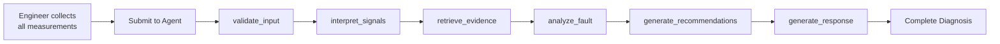
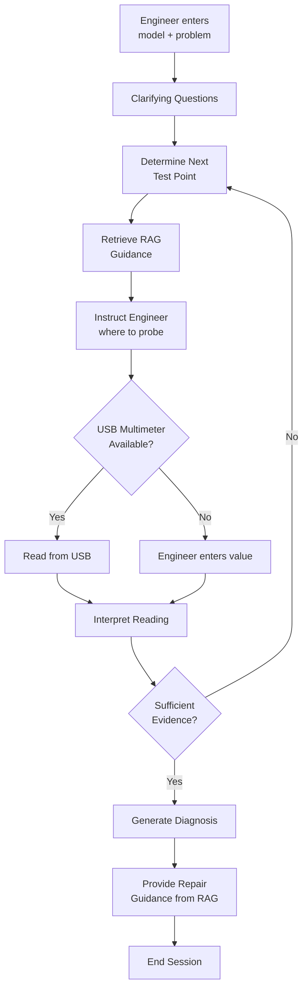
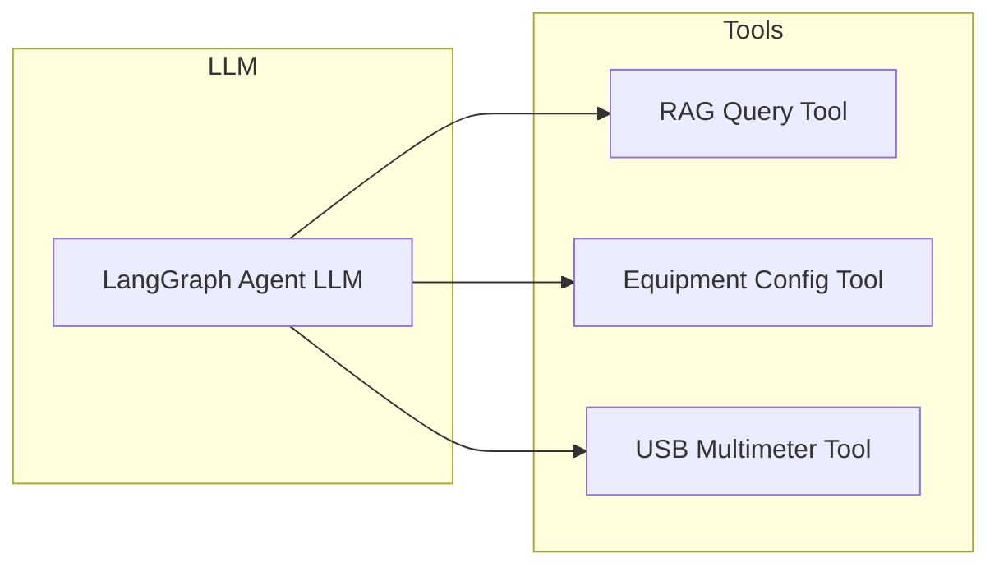
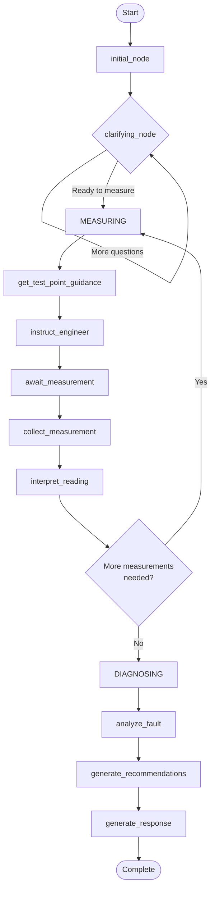
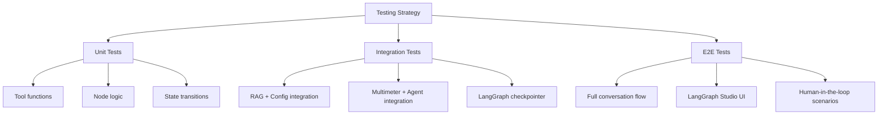

# Interactive LangSmith Studio Troubleshooting Agent - Implementation Plan

## Executive Summary

This document outlines a detailed technical implementation plan for transforming the existing batch-processing LangGraph agent into an interactive, conversational troubleshooting assistant that runs in LangGraph Studio. The new agent will guide engineers through a human-in-the-loop diagnostic workflow, leveraging USB multimeter readings and RAG-backed knowledge retrieval to provide accurate diagnoses and repair guidance.

**Key Design Principle**: All guidance provided to the engineer MUST come from RAG documents or equipment configuration files to prevent hallucination and ensure diagnostic accuracy.

---

## 1. Architecture Overview

### 1.1 Current Architecture (Batch Processing)

The existing system operates as a **batch-processing pipeline**:

1. Engineer collects all measurements manually
2. Engineer submits equipment model + measurements to agent
3. Agent runs through sequential nodes: `validate_input` → `interpret_signals` → `retrieve_evidence` → `analyze_fault` → `generate_recommendations` → `generate_response`
4. Agent returns complete diagnosis with recommendations

**Current Flow Diagram:**



### 1.2 Target Architecture (Conversational/Human-in-the-Loop)

The new architecture introduces **multi-turn conversation** with the engineer:

1. Engineer enters equipment model + vague problem (e.g., "not functional")
2. Agent asks clarifying questions via LLM
3. Agent retrieves relevant test point guidance from RAG
4. Agent instructs engineer where to place multimeter probes
5. Engineer places probes, reads/enters values from USB multimeter
6. Agent interprets readings, decides next measurement
7. Repeat steps 3-6 until sufficient evidence collected
8. Agent provides diagnosis and repair guidance from RAG

**Target Flow Diagram:**



### 1.3 Key Architectural Changes

| Component | Current | Target |
|-----------|---------|--------|
| **Interaction Model** | Single request/response | Multi-turn conversation |
| **State Management** | Stateless batch processing | Stateful conversation with checkpointing |
| **LLM Integration** | Final response generation only | Clarifying questions, test guidance, response synthesis |
| **Multimeter** | Not integrated | Tool-based USB/manual reading |
| **Control Flow** | Fixed node sequence | Dynamic branching based on conversation state |
| **Human Loop** | None | Engineer performs measurements, agent guides |

---

## 2. State Management for Conversational Workflow

### 2.1 New AgentState Dataclass

The existing `AgentState` in `src/application/agent.py` must be extended to support conversational workflow:

```python
@dataclass
class ConversationalAgentState:
    """
    State for conversational LangGraph Studio troubleshooting agent.
    
    Supports multi-turn dialogue with human-in-the-loop measurements.
    """
    
    # === SESSION METADATA ===
    session_id: str = ""
    equipment_model: str = ""
    equipment_serial: str = ""
    thread_id: str = ""  # LangGraph Studio thread
    
    # === INITIAL PROBLEM ===
    initial_problem: str = ""  # Engineer's vague problem description
    confirmed_symptoms: list[str] = field(default_factory=list)  # Clarified symptoms
    
    # === CONVERSATION TRACKING ===
    conversation_history: list[dict] = field(default_factory=list)
    current_node: str = "initial"  # Graph node for current conversation phase
    pending_question: str = ""  # Question agent is waiting to answer
    is_awaiting_measurement: bool = False
    
    # === MEASUREMENT COLLECTION ===
    collected_measurements: list[dict] = field(default_factory=list)
    test_points_measured: set[str] = field(default_factory=set)
    test_points_required: list[str] = field(default_factory=list)
    current_test_point: str = ""  # What agent wants to measure next
    
    # === DIAGNOSIS STATE ===
    signal_states: dict = field(default_factory=dict)
    overall_status: str = "unknown"
    hypothesis: dict = field(default_factory=dict)
    diagnosis_confidence: float = 0.0
    
    # === EVIDENCE & RAG ===
    retrieved_evidence: list[dict] = field(default_factory=list)
    guidance_retrieved: list[str] = field(default_factory=list)
    
    # === OUTPUT ===
    recommendations: list[dict] = field(default_factory=list)
    response: dict = field(default_factory=dict)
    
    # === WORKFLOW CONTROL ===
    workflow_phase: str = "initial"  # initial, clarifying, measuring, diagnosing, complete
    measurement_strategy: str = "protection_first"  # From equipment config
    
    # === ERROR HANDLING ===
    is_valid: bool = True
    validation_error: str = ""
    error_count: int = 0
    
    # === TIMING ===
    node_history: list[str] = field(default_factory=list)
    timestamp: str = ""
    processing_time_ms: int = 0
```

### 2.2 Conversation Phase States

The agent operates in distinct phases:

| Phase | Description | Key Actions |
|-------|-------------|-------------|
| `initial` | Engineer provides equipment model + problem | Parse problem, load equipment config |
| `clarifying` | Agent asks questions to narrow issue | LLM generates questions, engineer answers |
| `measuring` | Agent guides to test points | Request measurements, interpret results |
| `diagnosing` | Agent analyzes accumulated evidence | Match against fault signatures |
| `complete` | Final diagnosis provided | Show recommendations, repair steps |
| `error` | Recovery from errors | Ask engineer to re-measure or clarify |

### 2.3 LangGraph Checkpoint Configuration

For LangGraph Studio to maintain conversation state:

```python
from langgraph.checkpoint.memory import MemorySaver
from langgraph.checkpoint.postgres import PostgresSaver

# Development: In-memory checkpointing
checkpointer = MemorySaver()

# Production: PostgreSQL checkpointing (optional)
# checkpointer = PostgresSaver.from_conn_string(conn_string)
```

The graph must be compiled with the checkpointer:

```python
graph = builder.compile(checkpointer=checkpointer)
```

---

## 3. Tool Definitions

### 3.1 Tool Architecture Overview

Tools are the primary mechanism for the LLM to interact with external systems. The conversational agent requires three categories of tools:



### 3.2 RAG Query Tool

**Purpose**: Retrieve relevant diagnostic guidance from ChromaDB knowledge base.

**Design Principle**: ALL guidance must come from RAG to prevent hallucination.

```python
from typing import Optional
from langchain_core.tools import tool

@tool
def query_diagnostic_knowledge(
    query: str,
    equipment_model: str,
    category: Optional[str] = None,
    top_k: int = 5
) -> dict:
    """
    Query the diagnostic knowledge base for troubleshooting guidance.
    
    Args:
        query: Natural language query describing the symptom or measurement need
        equipment_model: Equipment model identifier (e.g., "cctv-psu-24w-v1")
        category: Optional filter - "measurement", "fault", "component", "safety"
        top_k: Maximum number of results to return
        
    Returns:
        Dict containing relevant document snippets with relevance scores.
        Each snippet includes: title, section, content, relevance_score.
        
    Example:
        query="how to measure output voltage on TP2"
        returns: [{"title": "MEAS-006", "content": "Output Voltage Measurement...", ...}]
    """
    # Implementation delegates to RAGRepository
    rag = RAGRepository.from_directory("data/chromadb")
    rag.initialize()
    
    # Build query with equipment context
    full_query = f"{query} {equipment_model}"
    if category:
        full_query = f"{category}: {full_query}"
    
    results = rag.retrieve(
        query=full_query,
        equipment_model=equipment_model,
        top_k=top_k
    )
    
    return {
        "query": query,
        "equipment_model": equipment_model,
        "results": [r.to_dict() for r in results],
        "result_count": len(results)
    }
```

**Example RAG Queries the Tool Handles:**

| Engineer Need | RAG Query |
|--------------|-----------|
| "What test points should I check first?" | "diagnostic gate priority measurement sequence" |
| "How do I measure the output voltage?" | "MEAS-006 output voltage measurement TP2 procedure" |
| "What does overvoltage mean?" | "SIG-005 overvoltage failure signature diagnosis" |
| "How do I replace the feedback resistor?" | "COMP-005 R2 replacement procedure safety" |

### 3.3 Equipment Configuration Tool

**Purpose**: Load and query equipment-specific configuration (thresholds, fault signatures, test points).

```python
@tool
def get_equipment_configuration(
    equipment_model: str,
    request_type: str
) -> dict:
    """
    Retrieve equipment-specific configuration data.
    
    Args:
        equipment_model: Equipment model identifier
        request_type: Type of configuration to retrieve:
            - "test_points": All test points with locations
            - "thresholds": Signal thresholds and semantic states
            - "faults": All fault definitions with signatures
            - "recovery": Recovery procedures for faults
            - "strategies": Troubleshooting strategy definitions
            
    Returns:
        Equipment configuration data from YAML files
    """
    from src.infrastructure.equipment_config import get_equipment_config
    
    config = get_equipment_config(equipment_model)
    
    if request_type == "test_points":
        return {"test_points": config.test_points}
    elif request_type == "thresholds":
        return {"thresholds": config.thresholds}
    elif request_type == "faults":
        return {"faults": config.faults}
    elif request_type == "recovery":
        return {"recovery": config.recovery_protocols}
    elif request_type == "strategies":
        return {"strategies": config.strategies}
    else:
        return {"error": f"Unknown request_type: {request_type}"}


@tool
def get_test_point_guidance(
    equipment_model: str,
    test_point_id: str
) -> dict:
    """
    Get detailed guidance for measuring a specific test point.
    
    Args:
        equipment_model: Equipment model identifier
        test_point_id: Test point identifier (e.g., "TP2", "F1")
        
    Returns:
        Test point details including location, nominal values, safety warnings
    """
    from src.infrastructure.equipment_config import get_equipment_config
    
    config = get_equipment_config(equipment_model)
    
    # Find test point in signals
    test_point = None
    for signal in config.signals:
        if signal.test_point == test_point_id:
            test_point = signal
            break
    
    if not test_point:
        return {"error": f"Test point {test_point_id} not found"}
    
    # Get threshold info
    threshold = config.thresholds.get(test_point_id)
    
    return {
        "test_point_id": test_point_id,
        "name": test_point.name,
        "location": test_point.location,
        "parameter": test_point.parameter,
        "unit": test_point.unit,
        "measurability": test_point.measurability,
        "threshold": threshold.to_dict() if threshold else None
    }
```

### 3.4 USB Multimeter Tool

**Purpose**: Read measurements from USB multimeter or accept manual entry.

```python
@tool
def read_multimeter(
    test_point_id: str,
    measurement_type: str = "voltage",
    timeout: float = 5.0
) -> dict:
    """
    Read a measurement from the USB multimeter.
    
    Args:
        test_point_id: The test point identifier (e.g., "TP2")
        measurement_type: Type of measurement - "voltage_dc", "voltage_ac", 
                         "resistance", "current_dc", "continuity"
        timeout: Maximum time to wait for reading in seconds
        
    Returns:
        Dict with measurement value, unit, and metadata.
        Includes test_point_id for correlation.
        
    Example:
        read_multimeter(test_point_id="TP2", measurement_type="voltage_dc")
        returns: {"test_point": "TP2", "value": 12.3, "unit": "V", ...}
    """
    from src.infrastructure.usb_multimeter import USBMultimeterClient
    
    client = USBMultimeterClient()
    
    if not client.connect():
        return {
            "error": "Could not connect to multimeter",
            "available_ports": client.list_available_ports(),
            "instruction": "Please connect the multimeter or enter reading manually"
        }
    
    try:
        reading = client.read_measurement(timeout=timeout)
        
        if reading:
            reading.test_point_id = test_point_id
            return reading.to_dict()
        else:
            return {
                "error": "No reading received",
                "instruction": "Check multimeter connection and try again"
            }
    finally:
        client.disconnect()


@tool
def enter_manual_reading(
    test_point_id: str,
    value: float,
    unit: str,
    measurement_type: str = "voltage"
) -> dict:
    """
    Record a manually entered multimeter reading.
    
    Use this when:
    - USB multimeter is not connected
    - Engineer prefers to read multimeter visually
    - USB reading failed
    
    Args:
        test_point_id: The test point identifier
        value: Measured value
        unit: Unit of measurement (V, A, Ohm, etc.)
        measurement_type: Type of measurement
        
    Returns:
        Confirmation of recorded reading with interpretation
    """
    from datetime import datetime
    
    reading = {
        "test_point": test_point_id,
        "value": value,
        "unit": unit,
        "measurement_type": measurement_type,
        "timestamp": datetime.utcnow().isoformat(),
        "source": "manual_entry"
    }
    
    return {
        "status": "recorded",
        "reading": reading,
        "instruction": "Recording complete. Awaiting analysis."
    }
```

### 3.5 Tool Binding in LangGraph

```python
from langchain_core.messages import HumanMessage, AIMessage, SystemMessage
from langgraph.prebuilt import create_react_agent

# Define tools
tools = [
    query_diagnostic_knowledge,
    get_equipment_configuration,
    get_test_point_guidance,
    read_multimeter,
    enter_manual_reading,
]

# Create the agent with tools
agent = create_react_agent(
    model="anthropic:claude-3-5-sonnet-20241022",
    tools=tools,
    state_schema=ConversationalAgentState,
)
```

---

## 4. LangGraph Node Design

### 4.1 Revised Node Architecture

The conversational agent replaces the fixed pipeline with state-driven nodes:



### 4.2 Node Implementations

#### 4.2.1 initial_node

```python
def initial_node(state: ConversationalAgentState) -> dict:
    """
    Process initial equipment model and problem description.
    
    Entry point for new troubleshooting sessions.
    """
    # Validate equipment model exists
    try:
        config = get_equipment_config(state.equipment_model)
    except FileNotFoundError:
        return {
            "is_valid": False,
            "validation_error": f"Equipment model '{state.equipment_model}' not found",
            "workflow_phase": "error"
        }
    
    # Load troubleshooting strategy
    strategy = config.strategies.get("active", "protection_first")
    
    # Get initial test points from strategy
    test_points = config.strategies.get("available", {}).get(strategy, {}).get("priority_order", [])
    
    return {
        "workflow_phase": "clarifying",
        "test_points_required": test_points,
        "measurement_strategy": strategy,
        "is_valid": True
    }
```

#### 4.2.2 clarifying_node

```python
def clarifying_node(state: ConversationalAgentState) -> dict:
    """
    Ask clarifying questions to narrow down the issue.
    
    Uses LLM to generate questions based on:
    - Initial problem description
    - Equipment configuration
    - Common failure modes
    """
    # Retrieve relevant failure signatures from RAG
    rag_results = query_diagnostic_knowledge.invoke({
        "query": state.initial_problem,
        "equipment_model": state.equipment_model,
        "category": "fault",
        "top_k": 3
    })
    
    # Use LLM to generate clarifying questions
    # (This would be integrated with the agent's LLM)
    
    # For now, return structured questions based on equipment
    clarifying_questions = [
        "Does the unit show any LED indicators?",
        "Is there any visible damage (burn marks, swelling)?",
        "Did the failure occur suddenly or gradually?",
        "Is the failure constant or intermittent?"
    ]
    
    return {
        "workflow_phase": "clarifying",
        "pending_question": "What symptoms do you observe?",
        "conversation_history": state.conversation_history + [
            {"role": "agent", "content": clarifying_questions[0]}
        ]
    }
```

#### 4.2.3 get_test_point_guidance_node

```python
def get_test_point_guidance_node(state: ConversationalAgentState) -> dict:
    """
    Retrieve guidance for the next test point to measure.
    
    Based on:
    - Current signal states
    - Equipment troubleshooting strategy
    - Previously collected measurements
    """
    # Determine next test point based on strategy
    next_tp = determine_next_test_point(
        state.test_points_measured,
        state.test_points_required,
        state.signal_states,
        state.measurement_strategy
    )
    
    # Get detailed guidance for this test point
    guidance = get_test_point_guidance.invoke({
        "equipment_model": state.equipment_model,
        "test_point_id": next_tp
    })
    
    # Also retrieve RAG documentation for this measurement
    rag_guidance = query_diagnostic_knowledge.invoke({
        "query": f"how to measure {next_tp} {state.equipment_model}",
        "equipment_model": state.equipment_model,
        "category": "measurement",
        "top_k": 2
    })
    
    return {
        "current_test_point": next_tp,
        "guidance_retrieved": state.guidance_retrieved + [guidance],
        "workflow_phase": "measuring",
        "is_awaiting_measurement": True
    }
```

#### 4.2.4 interpret_reading_node

```python
def interpret_reading_node(state: ConversationalAgentState) -> dict:
    """
    Interpret a new measurement and update signal states.
    
    Uses equipment thresholds to determine semantic state.
    """
    # Get threshold config for this test point
    config = get_equipment_config(state.equipment_model)
    threshold = config.thresholds.get(state.current_test_point)
    
    if not threshold:
        return {
            "validation_error": f"No threshold defined for {state.current_test_point}",
            "error_count": state.error_count + 1
        }
    
    # Get the latest measurement
    latest_measurement = state.collected_measurements[-1]
    
    # Interpret using threshold
    semantic_state = threshold.get_state(latest_measurement["value"])
    
    # Update signal states
    new_signal_states = state.signal_states.copy()
    new_signal_states[state.current_test_point] = {
        "value": latest_measurement["value"],
        "unit": latest_measurement["unit"],
        "semantic_state": semantic_state
    }
    
    # Update measured test points
    new_measured = state.test_points_measured.copy()
    new_measured.add(state.current_test_point)
    
    return {
        "signal_states": new_signal_states,
        "test_points_measured": new_measured,
        "is_awaiting_measurement": False
    }
```

#### 4.2.5 diagnose_node

```python
def diagnose_node(state: ConversationalAgentState) -> dict:
    """
    Analyze accumulated evidence to generate diagnosis.
    
    Matches signal states against fault signatures from equipment config.
    """
    # Load fault configurations
    config = get_equipment_config(state.equipment_model)
    
    # Build fault matcher
    fault_configs = {
        fault_id: fault 
        for fault_id, fault in config.faults.items()
    }
    generator = HypothesisGenerator(fault_configs)
    
    # Generate hypothesis
    hypothesis = generator.generate(
        equipment_id=state.equipment_model,
        signal_states={
            k: v["semantic_state"] 
            for k, v in state.signal_states.items()
        },
        evidence=[f"{k}: {v['semantic_state']}" for k, v in state.signal_states.items()]
    )
    
    # Calculate confidence based on measurements collected
    confidence = calculate_confidence(
        hypothesis,
        len(state.test_points_measured),
        len(state.test_points_required)
    )
    
    return {
        "workflow_phase": "diagnosing",
        "hypothesis": hypothesis,
        "diagnosis_confidence": confidence
    }
```

---

## 5. Entry Points and LangGraph Studio Configuration

### 5.1 LangGraph JSON Configuration

Update `langgraph.json` to point to the new conversational agent:

```json
{
  "dockerfile_lines": [],
  "graphs": {
    "troubleshooting_agent": "./src/studio/conversational_agent.py:graph"
  },
  "env": "./.env",
  "python_version": "3.11",
  "dependencies": [
    "."
  ]
}
```

### 5.2 Entry Point Module

Create `src/studio/conversational_agent.py`:

```python
"""
LangGraph Studio Compatible Conversational Troubleshooting Agent

This module provides a conversational interface for the troubleshooting agent
that supports human-in-the-loop measurements via USB multimeter.

Usage:
    langgraph dev
"""

from dotenv import load_dotenv
from pathlib import Path
from langgraph.graph import START, StateGraph
from langgraph.checkpoint.memory import MemorySaver

# Load environment variables at module level
_env_path = Path(__file__).parent.parent.parent / '.env'
load_dotenv(dotenv_path=_env_path)

from src.application.agent import (
    ConversationalAgentState,
    initial_node,
    clarifying_node,
    get_test_point_guidance_node,
    instruct_engineer_node,
    collect_measurement_node,
    interpret_reading_node,
    diagnose_node,
    generate_recommendations_node,
    generate_response_node,
)


def create_conversational_graph() -> "StateGraph":
    """
    Build the conversational troubleshooting graph.
    
    Supports multi-turn dialogue with human-in-the-loop measurements.
    """
    builder = StateGraph(ConversationalAgentState)
    
    # Add nodes
    builder.add_node("initial", initial_node)
    builder.add_node("clarifying", clarifying_node)
    builder.add_node("get_guidance", get_test_point_guidance_node)
    builder.add_node("instruct", instruct_engineer_node)
    builder.add_node("collect_measurement", collect_measurement_node)
    builder.add_node("interpret_reading", interpret_reading_node)
    builder.add_node("diagnose", diagnose_node)
    builder.add_node("recommendations", generate_recommendations_node)
    builder.add_node("response", generate_response_node)
    
    # Define conditional edges
    builder.add_edge(START, "initial")
    
    # Conditional flow based on workflow_phase
    def should_continue_clarifying(state: ConversationalAgentState) -> str:
        if state.workflow_phase == "clarifying":
            return "clarifying"
        elif state.workflow_phase == "measuring":
            return "get_guidance"
        elif state.workflow_phase in ("diagnosing", "complete"):
            return "diagnose"
        return "clarifying"
    
    builder.add_conditional_edges(
        "initial",
        should_continue_clarifying,
        {
            "clarifying": "clarifying",
            "get_guidance": "get_guidance",
            "diagnose": "diagnose"
        }
    )
    
    # Clarifying -> Measuring transition
    builder.add_edge("clarifying", "get_guidance")
    
    # Measurement loop
    builder.add_edge("get_guidance", "instruct")
    builder.add_edge("instruct", "collect_measurement")
    builder.add_edge("collect_measurement", "interpret_reading")
    
    # Decision: more measurements or diagnose
    def need_more_measurements(state: ConversationalAgentState) -> str:
        if has_sufficient_evidence(state):
            return "diagnose"
        return "get_guidance"
    
    builder.add_conditional_edges(
        "interpret_reading",
        need_more_measurements,
        {
            "get_guidance": "get_guidance",
            "diagnose": "diagnose"
        }
    )
    
    # Diagnosis flow
    builder.add_edge("diagnose", "recommendations")
    builder.add_edge("recommendations", "response")
    
    # Compile with checkpointer
    checkpointer = MemorySaver()
    graph = builder.compile(checkpointer=checkpointer)
    
    return graph


def graph():
    """
    Return the compiled conversational graph for LangGraph Studio.
    """
    return create_conversational_graph()


if __name__ == "__main__":
    compiled_graph = graph()
    print("Conversational graph compiled successfully!")
    print(f"Graph nodes: {list(compiled_graph.nodes.keys())}")
```

### 5.3 LangGraph Studio Execution

To run the agent in LangGraph Studio:

```bash
# Start LangGraph Studio dev server
langgraph dev

# This will:
# 1. Load the graph from langgraph.json
# 2. Start a local web server
# 3. Provide URL for LangGraph Studio interface
# 4. Enable conversation with the agent via chat UI
```

---

## 6. Testing Strategy

### 6.1 Testing Pyramid



### 6.2 Unit Tests

**Test Tool Functions:**

```python
# tests/test_tools.py
import pytest
from src.studio.tools import (
    query_diagnostic_knowledge,
    get_equipment_configuration,
    get_test_point_guidance,
    read_multimeter,
    enter_manual_reading,
)

def test_query_diagnostic_knowledge():
    """Test RAG query returns relevant results."""
    result = query_diagnostic_knowledge.invoke({
        "query": "output voltage measurement",
        "equipment_model": "cctv-psu-24w-v1",
        "top_k": 3
    })
    
    assert "results" in result
    assert result["result_count"] > 0
    assert any("TP2" in r.get("content", "") for r in result["results"])

def test_get_equipment_configuration():
    """Test equipment config retrieval."""
    result = get_equipment_configuration.invoke({
        "equipment_model": "cctv-psu-24w-v1",
        "request_type": "test_points"
    })
    
    assert "test_points" in result
    assert len(result["test_points"]) > 0

def test_enter_manual_reading():
    """Test manual measurement entry."""
    result = enter_manual_reading.invoke({
        "test_point_id": "TP2",
        "value": 12.3,
        "unit": "V",
        "measurement_type": "voltage_dc"
    })
    
    assert result["status"] == "recorded"
    assert result["reading"]["value"] == 12.3
```

**Test Node Logic:**

```python
# tests/test_nodes.py
import pytest
from src.application.agent import (
    ConversationalAgentState,
    initial_node,
    interpret_reading_node,
)

def test_initial_node_valid_equipment():
    """Test initial node with valid equipment."""
    state = ConversationalAgentState(
        equipment_model="cctv-psu-24w-v1",
        initial_problem="not functional"
    )
    
    result = initial_node(state)
    
    assert result["is_valid"] is True
    assert result["workflow_phase"] == "clarifying"

def test_initial_node_invalid_equipment():
    """Test initial node with invalid equipment."""
    state = ConversationalAgentState(
        equipment_model="unknown-model",
        initial_problem="not working"
    )
    
    result = initial_node(state)
    
    assert result["is_valid"] is False
    assert "not found" in result["validation_error"]

def test_interpret_reading_normal():
    """Test interpretation of normal reading."""
    state = ConversationalAgentState(
        equipment_model="cctv-psu-24w-v1",
        current_test_point="output_12v",
        collected_measurements=[{
            "test_point": "output_12v",
            "value": 12.1,
            "unit": "V"
        }],
        signal_states={}
    )
    
    result = interpret_reading_node(state)
    
    assert "signal_states" in result
    assert "output_12v" in result["signal_states"]
    assert result["signal_states"]["output_12v"]["semantic_state"] == "normal"
```

### 6.3 Integration Tests

```python
# tests/test_integration.py

def test_rag_and_config_integration():
    """Test RAG and equipment config work together."""
    # Query RAG for guidance
    rag_result = query_diagnostic_knowledge.invoke({
        "query": "12V output measurement",
        "equipment_model": "cctv-psu-24w-v1"
    })
    
    # Get equipment thresholds
    config_result = get_equipment_configuration.invoke({
        "equipment_model": "cctv-psu-24w-v1",
        "request_type": "thresholds"
    })
    
    # Verify consistency
    assert len(rag_result["results"]) > 0
    assert "output_12v" in config_result["thresholds"]

def test_conversation_state_persistence():
    """Test LangGraph checkpointer maintains state."""
    from src.studio.conversational_agent import create_conversational_graph
    
    graph = create_conversational_graph()
    
    # Create thread config
    config = {"configurable": {"thread_id": "test-thread-1"}}
    
    # Initial state
    initial_state = {
        "equipment_model": "cctv-psu-24w-v1",
        "initial_problem": "output dead"
    }
    
    # First invocation
    result1 = graph.invoke(initial_state, config)
    
    # Second invocation (should have previous state)
    result2 = graph.invoke({}, config)
    
    # Verify state preserved
    assert result2.get("equipment_model") == "cctv-psu-24w-v1"
```

### 6.4 End-to-End Tests

```python
# tests/test_e2e.py

def test_full_troubleshooting_flow():
    """Test complete troubleshooting conversation."""
    from src.studio.conversational_agent import create_conversational_graph
    
    graph = create_conversational_graph()
    config = {"configurable": {"thread_id": "e2e-test"}}
    
    # Step 1: Initial problem
    state1 = {
        "equipment_model": "cctv-psu-24w-v1",
        "initial_problem": "no output voltage"
    }
    result1 = graph.invoke(state1, config)
    
    # Step 2: Clarifying - provide symptom
    state2 = {
        "confirmed_symptoms": ["LED not lit", "fuse OK"]
    }
    result2 = graph.invoke(state2, config)
    
    # Step 3: Provide measurement
    state3 = {
        "collected_measurements": [{
            "test_point": "output_12v",
            "value": 0.0,
            "unit": "V"
        }]
    }
    result3 = graph.invoke(state3, config)
    
    # Verify diagnosis reached
    assert result3.get("workflow_phase") in ("diagnosing", "complete")
    assert "hypothesis" in result3 or "recommendations" in result3
```

### 6.5 Test Coverage Targets

| Category | Target Coverage | Key Files |
|----------|-----------------|-----------|
| Unit Tests | 80% | `tools.py`, `nodes.py`, `state.py` |
| Integration | 70% | RAG, Config, Multimeter integrations |
| E2E | Critical paths | Full conversation flows |

---

## 7. Implementation Roadmap

### Phase 1: Foundation (Week 1)

- [ ] Create `ConversationalAgentState` dataclass
- [ ] Implement tool functions (RAG, Config, Multimeter)
- [ ] Set up LangGraph checkpointer
- [ ] Configure `langgraph.json`

### Phase 2: Core Nodes (Week 2)

- [ ] Implement `initial_node` and `clarifying_node`
- [ ] Implement `get_test_point_guidance_node`
- [ ] Implement measurement collection nodes
- [ ] Implement `interpret_reading_node`

### Phase 3: Diagnosis (Week 3)

- [ ] Implement `diagnose_node` with fault matching
- [ ] Integrate RAG for repair guidance
- [ ] Implement confidence calculation
- [ ] Add error handling and recovery

### Phase 4: Testing & Refinement (Week 4)

- [ ] Write unit tests
- [ ] Write integration tests
- [ ] Conduct E2E testing
- [ ] Optimize for LangGraph Studio UI

---

## 8. Risk Mitigation

| Risk | Impact | Mitigation |
|------|--------|------------|
| **LLM hallucination** | High | ALL guidance must use RAG tool; validate against equipment config |
| **Multimeter connection failure** | Medium | Provide manual entry fallback; clear error messages |
| **State persistence issues** | High | Use PostgreSQL checkpointer for production; thorough testing |
| **Complex conversation flow** | Medium | Implement clear phase transitions; extensive logging |
| **RAG retrieval failures** | Medium | Fallback to equipment config; graceful degradation |

---

## 9. Key Files to Create/Modify

### New Files

| File | Purpose |
|------|---------|
| `src/studio/conversational_agent.py` | Main LangGraph Studio entry point |
| `src/studio/tools.py` | Tool definitions for LLM |
| `src/studio/nodes.py` | Conversational node implementations |
| `tests/test_tools.py` | Tool unit tests |
| `tests/test_nodes.py` | Node unit tests |
| `tests/test_integration.py` | Integration tests |
| `tests/test_e2e.py` | End-to-end tests |

### Files to Modify

| File | Modification |
|------|--------------|
| `src/application/agent.py` | Add `ConversationalAgentState` class |
| `langgraph.json` | Update to point to new graph |
| `src/infrastructure/usb_multimeter.py` | Add tool-compatible wrapper |

---

## 10. Conclusion

This implementation plan provides a comprehensive roadmap for building an interactive LangSmith Studio troubleshooting agent that:

1. **Engages engineers in conversation** to understand vague problem descriptions
2. **Guides measurement** with RAG-backed instructions
3. **Collects readings** via USB multimeter or manual entry
4. **Diagnoses faults** using equipment configuration signatures
5. **Provides repair guidance** exclusively from RAG documentation

The architecture maintains the existing codebase's principles of data-driven design while adding the conversational layer required for human-in-the-loop troubleshooting. All guidance flows through the RAG system to prevent hallucination and ensure diagnostic accuracy.
